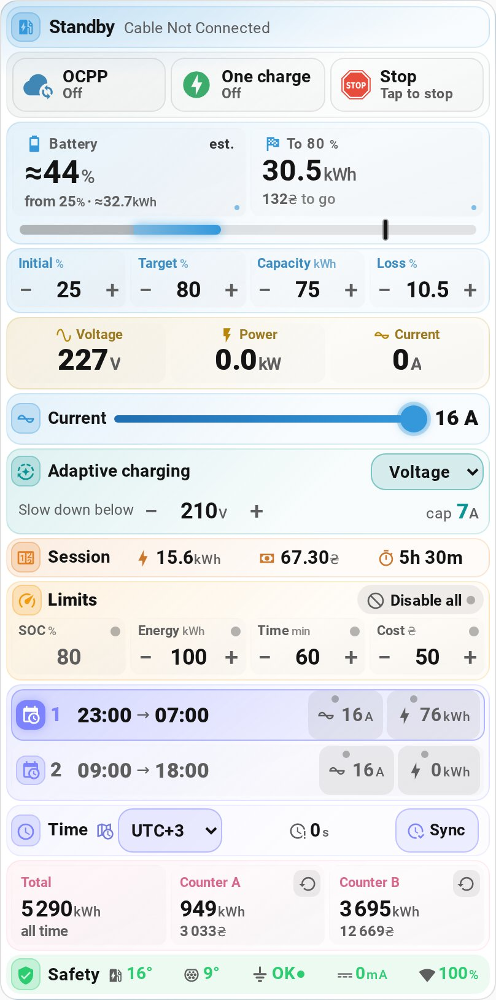
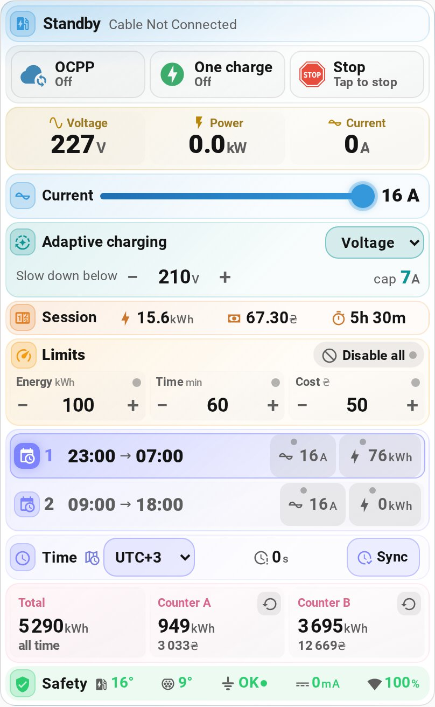

# Eveus EV Charger for Home Assistant

[](https://github.com/hacs/default)


[](https://github.com/ABovsh/eveus/releases)

**English** | [🇺🇦 Українська](README.uk.md)

Control your Eveus charger from Home Assistant: adjust charging current, set
schedules and limits, and view charger readings, energy use and charging cost.
The integration communicates with the charger over its local HTTP API without
requiring internet access.

<p align="center">
  
  
</p>

**Contents:** [Install](#installation) · [Setup](#setup) · [First charge](#first-charge) ·
[Card](#eveus-card) · [SOC](#battery-level-soc) · [Limits and schedules](#limits-schedules-and-cost) ·
[Automations](#blueprints) · [Help](#troubleshooting) · [Entities](#entity-ids) · [Changelog](CHANGELOG.md)

## Features

### 🎛️ Local charging control

- Adjust current, allow or stop charging from dashboards and automations.
- Enable one-charge mode and set time, energy and cost limits.
- The integration checks that the charger accepts commands; Home Assistant shows errors.

### 🔋 SOC and charging to a target

- **Battery and finish-time estimates** account for battery capacity and charging losses; see energy and cost to target too.
- **Initial SOC from your car sensor** is filled automatically when charging starts. The session calculation continues after pauses and Home Assistant restarts.
- **Stop at your target SOC** by enabling its limit. The integration handles the stop: Home Assistant must be running and able to reach the charger.

All SOC features require **Advanced mode**. [Set up SOC →](#battery-level-soc)

### 💰 Energy and charging cost

- **Costs from the charger** account for tariff changes during a session, including night-to-day rates.
- **Consumption tracking** covers the current session, lifetime total and separately resettable A/B counters; view history in the Energy dashboard.
- **Last-session summary** keeps energy, cost and duration available after Home Assistant restarts and while the charger is off.

### 📱 A ready-made card

- **Readings and controls in one card,** built from sections you tick and reorder in the card editor: status, buttons, battery SOC and its settings, voltage, power and current, current slider, adaptive charging, session, limits, schedules, charger clock, counters and safety.
- The card displays faults and asks before it stops a charge, raises the current or resets a counter.
- A [ready-made dashboard](#dashboard) provides separate cards and graphs. [Add the Eveus card →](#eveus-card)

### 🧩 Automations

- **Device triggers** cover car connection, charging start and finish, and charger errors.
- **Data for your own automations** includes finished-session energy, cost and duration; reaching the SOC limit has a separate event.
- **Two ready-made blueprints:** session notifications and stopping charging when your home inverter battery is low. [Import a blueprint →](#blueprints)

### ⚡ Charger readings

- **Voltage, current and power**, box and plug temperatures, ground status and leakage current; three-phase setups include individual phase current and voltage.
- **Not Charging Reason** explains what is holding up charging: the car, a schedule, a limit or OCPP control.

### 🕒 Schedules and adaptive charging

- **Two charging windows** with separate current and energy limits. Stored on the charger, they run independently of Home Assistant.
- **Reduced current when mains voltage drops** is handled by the charger; the integration exposes the mode and threshold settings and shows the current cap.

### 🛡️ Faults and conflicting controls

- **Repairs notices** explain ground faults, overheating, leakage and other problems, with suggested next steps.
- **OCPP control and connection status** are available in Home Assistant. While OCPP is enabled, the integration warns that the server or app may change settings.

Also supported: **multiple chargers**, **English and Ukrainian**, automatic reconnection and older firmware within the capabilities of its available data.

## Requirements

| Requirement | Details |
| --- | --- |
| Home Assistant | 2025.1 or newer |
| Charger | Eveus 16A, 32A, 40A, or 48A charger reachable from Home Assistant |
| Charger firmware | Verified on R3.05.x; [R3.01.x and 1.x](#older-charger-firmware) have fewer available readings |
| Network | Local LAN access to the charger HTTP API |
| Setup details | Charger IP/hostname or URL, username, password, model |

## Installation

### HACS

The integration is in the **HACS default store** — no custom repository needed.

[](https://my.home-assistant.io/redirect/hacs_repository/?owner=ABovsh&repository=eveus&category=integration)

Or find it in HACS:

1. Open **HACS** and search for **Eveus EV Charger**.
2. Install it.
3. Restart Home Assistant.

### Manual

1. Copy `custom_components/eveus` into your Home Assistant `custom_components/` directory.
2. Restart Home Assistant.

## Setup

[](https://my.home-assistant.io/redirect/config_flow_start/?domain=eveus)

1. Go to **Settings → Devices & Services → Add Integration** and search for **Eveus EV Charger**.
2. Enter the charger address — IP, hostname, or full URL (custom port, `http://`, and `https://` all work).
3. Enter the username and password. These are the charger's own web-interface credentials, **not** your Home Assistant login.
4. Pick the charger model: **16A**, **32A**, **40A**, or **48A**. Pick the one that matches your hardware — a mismatch stops the charger from reporting.
5. Pick the integration mode:
   - **Basic** — charging control and monitoring only.
   - **Advanced** — adds the SOC inputs and SOC/ETA sensors.
6. **Advanced only:** a second screen asks for your EV's **battery capacity (kWh)** and **charging efficiency loss (%)**. Both can be changed later from the entities themselves.

To change settings later, open the integration:

- **Configure** — mode and optional car SOC sensor; first-time Advanced setup also asks for battery capacity and losses.
- **Reconfigure** — address, credentials, model and phase count.

## First charge

1. Open the **Eveus EV Charger** device under **Settings → Devices & Services**. Check that **State** and **Voltage** have current values.
2. Set **Charging Current** to suit your electrical installation.
3. In Advanced mode, set **Initial SOC** to the car's current battery level or configure [automatic filling from the car](#filling-initial-soc-from-your-car-optional).
4. Connect the car. **Stop Charging** must be off to allow charging. If the charger waits, check **Not Charging Reason**: a schedule, limit, the car or OCPP may be delaying the start.
5. Check **State**, **Power** and **Session Energy**. To stop charging, turn on **Stop Charging**.

For everyday use, add the [Eveus card](#eveus-card).
Use the [ready-made dashboard](#dashboard) if you want separate cards and graphs.

## Eveus card

> [!WARNING]
> **Updating from 4.24.0 or earlier? Recreate the card.** The card has been rebuilt. Open **Edit dashboard**, delete each Eveus card, then **Add card → Eveus EV Charger**. Old cards keep working, but they miss the new sections.

The card is included with the integration. Each copy you add shows the
sections you choose, in the order you choose, and follows your Home Assistant
language (English or Ukrainian).

### Sections

| Section | Shows |
| --- | --- |
| **Status** | Charger state and why it is not charging |
| **Buttons** | **OCPP**, **One charge** and **Stop** |
| **Battery SOC** | Estimated SOC and where the session started; while charging, time left and finish time; energy and cost to target; **Advanced mode only** |
| **SOC settings** | **Initial**, **Target**, **Capacity** and **Loss**; **Advanced mode only** |
| **Meter** | Voltage, power and current |
| **Current slider** | Charging current |
| **Adaptive charging** | Adaptive Mode, its voltage threshold and current cap |
| **Session** | Session energy, cost and time |
| **Limits** | Energy, time, cost and SOC limits, **Disable all** |
| **Schedules** | Schedule 1 and Schedule 2, one row each: on/off, start → stop, current limit and energy limit |
| **Charger clock** | Time Zone, Time Drift and **Sync Time** |
| **Counters** | Total Energy, Counter A and Counter B, each with a reset |
| **Safety** | Box and plug temperature, ground, leakage current, connection quality |

In Basic mode the two SOC sections are hidden, and Limits has no SOC limit.
The card follows the integration mode; `mode: basic` simplifies it, while
`mode: advanced` requires Advanced integration mode.

- **Warnings:** voltage is red below 205 V or above 253 V; temperatures are red from 80 °C and leakage current from 30 mA, the charger's own fault limits; Time Drift is red from 10 minutes, when Home Assistant raises its clock Repairs notice. Faults and reasons for not charging appear in **Status**.
- **Offline:** shows the age of the last reading and disables controls.
- **Interaction:** tap a reading to open its entity. Long-press the battery tile, or focus it and press Alt+Enter, to set Initial SOC; use the target tile the same way for Target SOC. To stop an active charge, tap **Stop** again within four seconds. Raising **Current** asks as well: tap the new value within four seconds to apply it; lowering it applies at once. Resetting a counter asks for confirmation. In **Schedules**, tap a time to pick a new one, tap a limit's icon to turn it on or off, and tap its value to type a new one. A schedule's badge glows while the charger's clock places it in its window. The card omits that glow and the next-start time when Time Drift is unknown or at least 10 minutes.

### How to add the card

1. Restart Home Assistant after installing or updating the integration, then refresh your browser.
2. Open your dashboard → **Edit dashboard → Add card → Eveus EV Charger**.
3. Tick the sections you want, reorder them with the arrows, and **Save**. Tap a section's settings icon to hide single items, e.g. Schedule 2. **Default order** restores all sections. Set **Charger** if you have several; **Mode** and **Language** are optional.

In the mobile app, refresh through **Settings → Companion app → Troubleshooting →
Reset frontend cache**, then restart the app.

### Card in YAML

```yaml
type: custom:eveus-card
sections:            # any of these, in any order; omit for all of them
  - status
  - actions          # OCPP · One charge · Stop
  - advanced_info    # Battery SOC (Advanced only)
  - advanced_controls  # SOC settings (Advanced only)
  - basic_info       # voltage · power · current
  - current
  - adaptive
  - session
  - limits
  - schedules        # schedule 1 · 2
  - time             # time zone · drift · sync
  - history          # counters
  - safety
# hide:              # single items: section.item
#   - schedules.schedule_2
#   - safety.connection
# device_id: ...     # only with several chargers
# mode: basic        # advanced | basic (default: follows the integration)
# language: uk       # auto (default, Home Assistant's language) | uk | en
```

Cards saved with the earlier `layout:` option keep working: `compact`,
`status`, `control` and `full` open as the matching sections.

If **Custom element doesn't exist** appears after an update, refresh the browser or reset the app's frontend cache.

## Dashboard

For separate cards and graphs, use the **Sections** view in
[`docs/dashboard.yaml`](docs/dashboard.yaml) ([Ukrainian](docs/dashboard-uk.yaml)).
Install [`mini-graph-card`](https://github.com/kalkih/mini-graph-card) from HACS
for its two graphs; the other cards are standard Home Assistant cards.

[Preview](https://github.com/user-attachments/assets/064dd525-ecb9-4f7f-ac0c-2dc9a16b7039)

> [!IMPORTANT]
> This file is a **whole dashboard view**. Add it under `views:` in the raw
> configuration editor, not through **Add card → Manual**.

### How to add the dashboard

1. Open or create a dashboard under **Settings → Dashboards**.
2. Choose **Edit dashboard → ⋮ → Raw configuration editor**.
3. Paste the entire [`docs/dashboard.yaml`](docs/dashboard.yaml) as a new item under `views:`, with this indentation:

   ```yaml
   views:
     - title: Eveus
       path: eveus
       type: sections
       sections:
         # Remaining file content goes here; keep its original indentation.
   ```

4. Replace `eveus_ev_charger` if your entity IDs use another prefix, then **Save**.

For three phases, set **Phases = 3** and add
`sensor.eveus_ev_charger_current_phase_2`/`_3` and `…_voltage_phase_2`/`_3`
to the view.

## Battery level (SOC)

SOC is the car battery's state of charge, expressed as a percentage. In
**Advanced** mode, the integration estimates it from initial SOC, session
energy, battery capacity and charging losses. Accuracy depends on these inputs.

| Setting | What to enter |
| --- | --- |
| **Initial SOC** | Battery level before the current plug-in; set manually or filled from a car sensor |
| **Target SOC** | Desired battery level for forecasts and the SOC stop limit |
| **Battery Capacity** | Your car's battery capacity in kWh |
| **SOC Correction** | Percentage of delivered energy lost during charging |

**Time to Target SOC** and **Charging Finish Time** are estimates and may change
as charging power changes. **Energy to Target SOC** includes charging losses;
**Cost to Target SOC** uses the current tariff. Setting a target alone does not
stop charging — turn on **Limit: SOC enabled** to enable that behavior.

The integration enforces the SOC limit: Home Assistant must be running and able
to reach the charger. The charger itself enforces time, energy and cost limits.

### Filling Initial SOC from your car (optional)

In Advanced mode, **Initial SOC** can be filled from a car sensor provided by another integration.

1. Pick the car battery sensor during SOC setup, or later under **Settings → Devices & Services → Eveus EV Charger → Configure**.
2. Use a `sensor` with device class `battery`, unit `%` and a value from 0 to 100. If it is missing from the list, check its domain and device class.
3. If no sensor is selected, set **Initial SOC** manually before charging.

- The car sensor is read once per plug-in when charging starts. If unavailable, the integration retries and accounts for energy already delivered when a reading arrives.
- Pauses and Home Assistant restarts retain the current calculation. After unplugging and reconnecting, a new initial value is needed.
- A manually entered value takes priority until the next plug-in.
- To check the source or a failed reading, see the `soc_anchor` attribute of **SOC Percent**, the integration log or the `soc` section of **Download diagnostics**.

<details>
<summary>Migrating from legacy SOC helpers</summary>

Migration from old helpers is intentionally simple: replace the prefix `input_number.ev_` with `number.eveus_ev_charger_` in cards and automations. For example, `input_number.ev_initial_soc` becomes `number.eveus_ev_charger_initial_soc`.

</details>

## Limits, schedules and cost

### Charging limits

Set **Limit: Time**, **Limit: Energy** or **Limit: Cost**, then turn on its
corresponding enable switch. **Limit: disable all** suspends the limits,
including SOC, while retaining their values.

### Schedules and adaptive charging

The charger has two schedule slots. Set start and stop times, enable the slot
and optionally enable its own current and energy limits. Schedules are stored
on the charger and run independently of Home Assistant. If a schedule runs at
the wrong time, check **Time Zone** and press **Sync Time**.

**Adaptive Mode** offers Off / Voltage / Auto / Power. In Voltage mode, the
charger reduces current when voltage drops; **Undervoltage threshold** can be
set from 210 to 220 V. **Adaptive Current Limit** shows the cap selected by the
charger. **Minimum voltage** is a separate lower voltage limit for charging,
from 150 to 200 V.

### Energy and cost tracking

The integration shows current and last sessions, total consumption and counters
A/B, which can be reset separately. The charger calculates session and counter
costs using its configured tariffs, including tariff changes during a session.
Tariff rates are available as sensors in Home Assistant; change them on the
charger. For consumption history, add the charger to the [Energy dashboard](#energy-dashboard).

### OCPP control

**Connect to OCPP** allows the charger to connect to its OCPP server, used by
apps such as Grizzl-E Connect. **OCPP Connected** shows the connection status.
The server or app may change current, limits and schedules, so the integration
shows a **Repairs** notice while OCPP is enabled. Turn off **Connect to OCPP**
to control the charger only through its local interface and Home Assistant.
A remote OCPP server may require internet access.

## Energy Dashboard

To add EV charging to Home Assistant's Energy dashboard:

1. Go to **Settings → Energy** (before Home Assistant 2026: **Settings → Dashboards → Energy**).
2. Under **Individual devices**, click **Add device**.
3. Pick `sensor.eveus_ev_charger_total_energy` and save.

See charging consumption by day or month. Session and counter costs use the
tariffs configured on the charger.

## Blueprints

Two ready-made automations ship with the integration. Import either one from
**Settings → Automations & Scenes → Blueprints → Import Blueprint**, paste the
URL, then fill in the two or three fields it asks for — no YAML.

| Blueprint | What it does | URL |
| --- | --- | --- |
| Charging session notification | Notifies on start and finish through the action of your choice; the finish message includes session energy, cost and duration | [`notify_session.yaml`](https://github.com/ABovsh/eveus/blob/main/blueprints/automation/eveus/notify_session.yaml) |
| Stop charging on low house battery | When your inverter's battery stays below a threshold for two minutes, stops charging with the charger's own **Stop Charging** switch, not by cutting its power. Does not automatically resume charging after recovery | [`stop_on_low_house_battery.yaml`](https://github.com/ABovsh/eveus/blob/main/blueprints/automation/eveus/stop_on_low_house_battery.yaml) |

## Events & Device Triggers

The integration fires events on the Home Assistant event bus for charger state transitions. Every payload includes `device_number`:

| Event | Fires when | Extra payload fields |
| --- | --- | --- |
| `eveus_charging_started` | A charging session begins | — |
| `eveus_charging_finished` | A charging session ends | `reason` (`complete`, `unplugged`, `stopped`, or `paused`), `session_energy_kwh`, `session_cost`, `session_duration_s` |
| `eveus_error` | The charger enters the error state | `error_code`, `error_text` |
| `eveus_car_connected` | The car is electrically connected | — |
| `eveus_car_disconnected` | The car is disconnected | — |

Finished-session values come from the last charging poll and may lag final
values by one poll interval. Changes while HA or the charger is offline do not
produce events after reconnection.

For these five events, select the Eveus device in the automation editor to use
its matching **device triggers** without YAML.

For automations that need the event payload, trigger on the event directly:

```yaml
automation:
  - alias: Eveus session summary
    triggers:
      - trigger: event
        event_type: eveus_charging_finished
    actions:
      - action: notify.notify
        data:
          message: >-
            Session finished ({{ trigger.event.data.reason }}):
            {{ trigger.event.data.session_energy_kwh }} kWh,
            {{ trigger.event.data.session_cost }} UAH
```

### Reaching Target SOC

When the integration confirms a stop at the SOC limit, it fires
`eveus_soc_limit_reached` with `device_number`, `soc` and `target_soc`.

You can route that event to your own notification automation:

```yaml
automation:
  - alias: Eveus SOC limit reached
    triggers:
      - trigger: event
        event_type: eveus_soc_limit_reached
    actions:
      - action: notify.notify
        data:
          message: "Eveus reached target SOC: {{ trigger.event.data.soc }}%"
```

## 🛡️ Safety notices

Open **Settings → System → Repairs** for the cause and suggested action.
These notices report problems; they do not replace the charger's hardware protection.
Temperature, leakage and ground readings require repeated confirmation;
known charger fault codes trigger a notice immediately.

### Safety conditions

| Notice | Action |
| --- | --- |
| Ground is missing | Stop charging and have an electrician check the grounding |
| Ground protection is disabled | Enable **Ground Protection**; disabling it allows charging without confirmed ground |
| Box or plug overheating | Stop using the charger and let it cool; contact the manufacturer if it repeats. The integration warns at sustained **80 °C or higher** or a charger overheat fault |
| Current leakage (GFCI) | Stop using the charger and contact the manufacturer; triggered by a fault or sustained leakage of **30 mA or more** |
| Charger protection fault | Stop or avoid charging and contact the manufacturer |
| Charger error with unknown cause | Check the charger's display/app; include the error in a support request if it persists |
| Charger backup battery is low | Replace the internal CR2032 cell |

Ground notices clear after recovery. Serious fault notices also require
**Ignore**; after recovery, a new incident can notify you again.

### Configuration notices

| Notice | Action |
| --- | --- |
| Charger setup needs attention | Open the notice and re-enter connection details |
| OCPP is enabled | If you want local control only, turn off **Connect to OCPP** |
| Charger clock is off by more than 10 minutes | Check **Time Zone**, then press **Sync Time** |
| Update SOC cards and automations | Replace `input_number.ev_*` references with the native SOC entities; see [migration](#battery-level-soc) |

## Troubleshooting

More help: [integration website](https://abovsh.github.io/eveus/) · [community discussion](https://community.home-assistant.io/t/eveus-ev-charger-home-assistant-integration-local-only-hacs/1010628) · [report an issue](https://github.com/ABovsh/eveus/issues).

| Problem | What to check |
| --- | --- |
| Setup cannot connect | Read the error in the setup dialog; check power, network access from HA, credentials and charger model |
| Controls do not respond | Check **Connection Quality**, whether the charger is reachable, and the credentials via **Reconfigure**; then wait for the next poll |
| SOC sensors are missing | Set the integration mode to Advanced under **Configure**; the integration reloads automatically after saving |
| SOC looks wrong after unplug/replug | Update `number.eveus_ev_charger_initial_soc` to the real battery percentage before starting the next session |
| Charger is powered off | This is normal: the integration polls less often and does not fill the log with errors |
| A Repairs notice appeared | See [Safety notices](#-safety-notices) for what each one means and what to do |
| The charger is nowhere in Devices | See [The charger does not appear after installing](#the-charger-does-not-appear-after-installing) |

### Charger connection

The integration polls more often while charging and less often when idle.
After power and network connectivity return, readings normally recover within
a minute — whether the charger was switched off during a session or before
Home Assistant started. Command acceptance and setting changes are checked; Home Assistant
shows errors. If the charger rejects credentials after a password change, the
integration asks you to enter them again.

### The charger does not appear after installing

Work through these in order:

1. **Add the integration after installing through HACS.** Restart Home Assistant, then open **Settings → Devices & Services → Add Integration → Eveus EV Charger**. A single update entity means you are viewing the HACS entry, not the charger.
2. **Check disabled integrations.** At the bottom of the **Integrations** tab, click **Show disabled integrations** and enable Eveus if listed.
3. **Open the Eveus card on the Integrations tab.** If it shows **Failed setup, will retry**, open the error details. The error also appears in **Settings → System → Logs**. The device only appears after setup succeeds.

The number of entities depends on the integration mode and phase count.

### Older charger firmware

R3.01.x and firmware 1.x (EnergyStar V-series) are supported, with fewer
available readings. Fields the charger does not report remain unavailable.
Unrecognized states show `Unknown`; the numeric code is in the **State**
sensor's `raw_state` attribute.

For firmware files, contact **@energy_star** on Telegram; install them through
the charger's web interface.

If setup fails, [report an issue](https://github.com/ABovsh/eveus/issues) with
the firmware version, setup error and the Eveus warning from
**Settings → System → Logs**. Remove IP addresses and serial numbers before sharing.

## Entity IDs

Default IDs below assume a charger named **Eveus EV Charger**. Check your
device page for actual IDs if you renamed entities or added several chargers.
Normal updates retain entity identity and history.

### Charging State And Controls

<details>
<summary>Show entities</summary>

| Entity ID | What it gives you |
| --- | --- |
| `sensor.eveus_ev_charger_state` | Main charger state; selectable values in automation triggers |
| `sensor.eveus_ev_charger_substate` | Detailed state or fault; selectable values in automation triggers |
| `sensor.eveus_ev_charger_not_charging_reason` | Why charging is waiting; **Controlled by OCPP** while OCPP is on. Fault details: `error` attribute (modern firmware) |
| `binary_sensor.eveus_ev_charger_car_connected` | Vehicle is electrically connected |
| `binary_sensor.eveus_ev_charger_session_active` | Charging session is active or paused |
| `binary_sensor.eveus_ev_charger_ocpp_connected` | Reported OCPP connection state (diagnostic) |
| `number.eveus_ev_charger_charging_current` | Current limit (A); bounds depend on the charger model |
| `number.eveus_ev_charger_limit_time` | **Limit: Time** session limit (min) |
| `number.eveus_ev_charger_limit_energy` | **Limit: Energy** session limit (kWh) |
| `number.eveus_ev_charger_limit_cost` | **Limit: Cost** session limit (UAH) |
| `select.eveus_ev_charger_minimum_voltage` | **Minimum voltage** — lowest charging voltage (150–200 V); separate from the adaptive threshold |
| `switch.eveus_ev_charger_stop_charging` | Stop/allow charging from the charger side |
| `switch.eveus_ev_charger_one_charge` | Enable one-charge mode |
| `switch.eveus_ev_charger_ground_protection` | Missing-ground shutdown protection |
| `switch.eveus_ev_charger_connect_to_ocpp` | OCPP connection; the server/app may override local controls |
| `switch.eveus_ev_charger_limit_time_enabled` | **Limit: Time enabled** |
| `switch.eveus_ev_charger_limit_energy_enabled` | **Limit: Energy enabled** |
| `switch.eveus_ev_charger_limit_cost_enabled` | **Limit: Cost enabled** |
| `switch.eveus_ev_charger_limit_disable_all` | **Limit: disable all** |
| `switch.eveus_ev_charger_limit_soc_enabled` | **Limit: SOC enabled** (Advanced mode only) |
| `button.eveus_ev_charger_force_refresh` | Poll the charger immediately |

</details>

### Charger readings

<details>
<summary>Show entities</summary>

| Entity ID | Unit | What it gives you |
| --- | --- | --- |
| `sensor.eveus_ev_charger_voltage` | V | Line voltage |
| `sensor.eveus_ev_charger_current` | A | Charging current |
| `sensor.eveus_ev_charger_power` | W | Charging power |
| `sensor.eveus_ev_charger_current_set` | A | Charger current setpoint |
| `sensor.eveus_ev_charger_current_phase_2` | A | Phase 2 current when `Phases = 3` |
| `sensor.eveus_ev_charger_current_phase_3` | A | Phase 3 current when `Phases = 3` |
| `sensor.eveus_ev_charger_voltage_phase_2` | V | Phase 2 voltage when `Phases = 3` |
| `sensor.eveus_ev_charger_voltage_phase_3` | V | Phase 3 voltage when `Phases = 3` |

</details>

### Energy, Cost, And Tariffs

<details>
<summary>Show entities</summary>

| Entity ID | Unit | What it gives you |
| --- | --- | --- |
| `sensor.eveus_ev_charger_session_time` | Sensor | Elapsed duration of the current charging session |
| `sensor.eveus_ev_charger_session_energy` | kWh | Energy delivered in the current session |
| `sensor.eveus_ev_charger_total_energy` | kWh | Lifetime energy counter |
| `sensor.eveus_ev_charger_counter_a_energy` | kWh | Resettable energy counter A |
| `sensor.eveus_ev_charger_counter_b_energy` | kWh | Resettable energy counter B |
| `sensor.eveus_ev_charger_session_cost` | UAH | Current session cost from the charger |
| `sensor.eveus_ev_charger_counter_a_cost` | UAH | Cost accumulated on counter A |
| `sensor.eveus_ev_charger_counter_b_cost` | UAH | Cost accumulated on counter B |
| `sensor.eveus_ev_charger_primary_rate_cost` | UAH/kWh | Primary tariff |
| `sensor.eveus_ev_charger_active_rate_cost` | UAH/kWh | Currently active tariff |
| `sensor.eveus_ev_charger_rate_2_cost` | UAH/kWh | Rate 2 price |
| `sensor.eveus_ev_charger_rate_3_cost` | UAH/kWh | Rate 3 price |
| `sensor.eveus_ev_charger_rate_2_status` | Sensor | Whether Rate 2 schedule is enabled |
| `sensor.eveus_ev_charger_rate_3_status` | Sensor | Whether Rate 3 schedule is enabled |
| `sensor.eveus_ev_charger_last_session_energy` | kWh | Last finished session energy; retained across restarts and outages |
| `sensor.eveus_ev_charger_last_session_cost` | UAH | Cost of the most recently finished session |
| `sensor.eveus_ev_charger_last_session_duration` | s | Duration of the most recently finished session |

Each Last Session sensor is populated when a session finishes and carries `reason` and `finished_at` attributes.

</details>

### SOC And ETA, Advanced Mode

Advanced mode provides four `number` entities for SOC settings.

<details>
<summary>Show entities</summary>

| Entity ID | Unit | Range | Default | What it gives you |
| --- | --- | --- | --- | --- |
| `number.eveus_ev_charger_initial_soc` | % | 0-100, step 1 | 20 | Battery SOC at the start of the current charging session |
| `number.eveus_ev_charger_target_soc` | % | 0-100, step 5 | 80 | Target battery level for forecasts and the SOC limit |
| `number.eveus_ev_charger_battery_capacity` | kWh | 10-160, step 1 | 50 | EV battery capacity |
| `number.eveus_ev_charger_soc_correction` | % | 0-20, step 0.5 | 7.5 | Charging loss correction |
| `sensor.eveus_ev_charger_soc_energy` | kWh | - | - | Estimated energy currently in the EV battery |
| `sensor.eveus_ev_charger_soc_percent` | % | - | - | Estimated battery percentage |
| `sensor.eveus_ev_charger_time_to_target_soc` | Sensor | - | - | Human-readable ETA to target SOC |
| `sensor.eveus_ev_charger_charging_finish_time` | Timestamp | - | - | Absolute finish time for automations and timestamp cards |
| `sensor.eveus_ev_charger_energy_to_target_soc` | kWh | - | - | Grid energy still needed to reach Target SOC (charging losses included) |
| `sensor.eveus_ev_charger_cost_to_target_soc` | UAH | - | - | Forecast cost of reaching Target SOC at the active tariff rate |

</details>

### Adaptive Charging And Schedules

<details>
<summary>Show entities</summary>

| Entity ID | Type | What it gives you |
| --- | --- | --- |
| `select.eveus_ev_charger_adaptive_mode` | Select | Adaptive mode: Off / Voltage / Auto / Power |
| `sensor.eveus_ev_charger_adaptive_charging` | Sensor | Active adaptive mode (Off / Voltage / Auto / Power) |
| `sensor.eveus_ev_charger_adaptive_current_limit` | A | Current cap selected by adaptive mode |
| `number.eveus_ev_charger_undervoltage_threshold` | V | **Undervoltage threshold** — Voltage-mode trigger (210–220 V) |
| `switch.eveus_ev_charger_schedule_1_enabled` | Switch | Enable or disable schedule slot 1 |
| `time.eveus_ev_charger_schedule_1_start` | Time | Schedule 1 start time |
| `time.eveus_ev_charger_schedule_1_stop` | Time | Schedule 1 stop time |
| `number.eveus_ev_charger_schedule_1_current_limit` | A | **Schedule 1 Current limit** |
| `switch.eveus_ev_charger_schedule_1_current_limit_enabled` | Switch | **Schedule 1 Current limit enabled** |
| `number.eveus_ev_charger_schedule_1_energy_limit` | kWh | **Schedule 1 Energy limit** |
| `switch.eveus_ev_charger_schedule_1_energy_limit_enabled` | Switch | **Schedule 1 Energy limit enabled** |
| `sensor.eveus_ev_charger_schedule_1` | Sensor | Schedule 1 summary and attributes |
| `switch.eveus_ev_charger_schedule_2_enabled` | Switch | Enable or disable schedule slot 2 |
| `time.eveus_ev_charger_schedule_2_start` | Time | Schedule 2 start time |
| `time.eveus_ev_charger_schedule_2_stop` | Time | Schedule 2 stop time |
| `number.eveus_ev_charger_schedule_2_current_limit` | A | **Schedule 2 Current limit** |
| `switch.eveus_ev_charger_schedule_2_current_limit_enabled` | Switch | **Schedule 2 Current limit enabled** |
| `number.eveus_ev_charger_schedule_2_energy_limit` | kWh | **Schedule 2 Energy limit** |
| `switch.eveus_ev_charger_schedule_2_energy_limit_enabled` | Switch | **Schedule 2 Energy limit enabled** |
| `sensor.eveus_ev_charger_schedule_2` | Sensor | Schedule 2 summary and attributes |

Each schedule has its own current and energy caps with separate enable switches.

</details>

### Diagnostics And Maintenance

<details>
<summary>Show entities</summary>

| Entity ID | Unit | What it gives you |
| --- | --- | --- |
| `sensor.eveus_ev_charger_connection_quality` | % | Recent polling success, latency, and health attributes |
| `sensor.eveus_ev_charger_ground` | Sensor | Ground status |
| `sensor.eveus_ev_charger_time_drift` | s | Charger local clock vs Home Assistant local time (0 = in sync; a steady ±3600 means a wrong Time Zone or DST mismatch) |
| `sensor.eveus_ev_charger_box_temperature` | °C | Charger body temperature |
| `sensor.eveus_ev_charger_plug_temperature` | °C | Plug temperature |
| `sensor.eveus_ev_charger_battery_voltage` | V | Charger backup battery voltage |
| `sensor.eveus_ev_charger_leakage_current` | mA | Current leakage reading |
| `sensor.eveus_ev_charger_leakage_current_peak` | mA | Peak leakage reading |
| `sensor.eveus_ev_charger_wifi_signal` | dBm | Charger Wi-Fi signal |
| `select.eveus_ev_charger_time_zone` | Select | Charger time-zone offset, `-12` to `+14` |
| `button.eveus_ev_charger_sync_time` | Button | Push Home Assistant time to the charger |
| `button.eveus_ev_charger_reset_counter_a` | Button | Reset counter A |
| `button.eveus_ev_charger_reset_counter_b` | Button | Reset counter B |

</details>

## Privacy And Diagnostics

Home Assistant stores connection details, SOC settings and the last-session summary. Entity history follows your Recorder settings. Diagnostics downloads redact credentials and identifying fields before export. Charger communication stays on your LAN.

## License

MIT.
