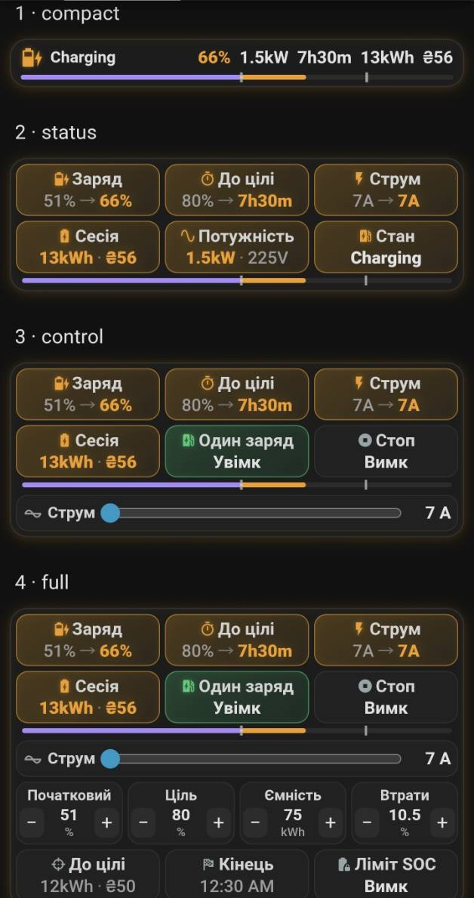
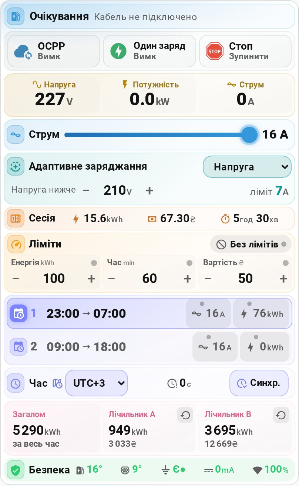

# Eveus EV Charger для Home Assistant

[](https://github.com/hacs/default)


[](https://github.com/ABovsh/eveus/releases)

[English](README.md) | **🇺🇦 Українська**

Керуйте зарядною станцією Eveus із Home Assistant: змінюйте струм, задавайте
розклади й ліміти, переглядайте показники станції, споживання та вартість
заряджання. Обмін даними зі станцією відбувається в локальній мережі через
HTTP API й не потребує інтернету.

<p align="center">
  
  
</p>

**Зміст:** [Встановлення](#встановлення) · [Налаштування](#налаштування) ·
[Перше заряджання](#перше-заряджання) · [Картка](#картка-eveus) ·
[SOC](#рівень-заряду-батареї-soc) · [Ліміти й розклади](#ліміти-розклади-та-вартість) ·
[Автоматизації](#проекти-автоматизацій) · [Допомога](#усунення-несправностей) ·
[Сутності](#ідентифікатори-сутностей) · [Зміни](CHANGELOG.md)

## Можливості

### 🎛️ Локальне керування заряджанням

- Змінюйте струм, дозволяйте й зупиняйте заряджання з панелі або автоматизацій.
- Вмикайте одноразове заряджання та ліміти часу, енергії й вартості.
- Інтеграція перевіряє прийняття команд станцією; помилки показує Home Assistant.

### 🔋 SOC і заряджання до цілі

- **Оцінка заряду й часу завершення** — з урахуванням ємності батареї та втрат; також видно енергію й вартість до цілі.
- **Початковий SOC із сенсора авто** — автоматично на початку заряджання. Розрахунок сесії зберігається після паузи й перезапуску Home Assistant.
- **Зупинка за цільовим SOC** — якщо ввімкнено відповідний ліміт. Її виконує інтеграція: Home Assistant має працювати й мати зв'язок зі станцією.

Усі можливості SOC доступні в **Розширеному режимі**. [Налаштування SOC →](#рівень-заряду-батареї-soc)

### 💰 Енергія й вартість заряджання

- **Вартість зі станції** враховує зміну тарифу під час сесії, зокрема нічного на денний.
- **Облік споживання** — поточна сесія, загальне споживання та окремі лічильники A/B, які можна скидати; історія — на панелі «Енергія».
- **Підсумок останньої сесії** — енергія, вартість і тривалість доступні після перезапуску Home Assistant і коли станцію вимкнено.

### 📱 Готова картка

- **Показники й керування на одній картці,** зібраній із розділів, які ви вмикаєте й упорядковуєте в редакторі картки: стан, кнопки, заряд батареї та його налаштування, напруга, потужність і струм, повзунок струму, адаптивне заряджання, сесія, ліміти, розклади, годинник станції, лічильники й безпека.
- Картка показує несправності й перепитує, перш ніж зупинити заряджання, збільшити струм або скинути лічильник.
- Для окремих карток і графіків є [готова панель](#готова-панель). [Додати картку Eveus →](#картка-eveus)

### 🧩 Автоматизації

- **Тригери пристрою** — під'єднання авто, початок і завершення заряджання, помилка станції.
- **Дані для власних сценаріїв** — енергія, вартість і тривалість завершеної сесії; окрема подія досягнення ліміту SOC.
- **Два готові проекти:** сповіщення про сесію та зупинка заряджання при низькому заряді батареї домашнього інвертора. [Імпортувати →](#проекти-автоматизацій)

### ⚡ Показники станції

- **Напруга, струм, потужність**, температури корпусу й конектора, заземлення та струм витоку; для трьох фаз — окремі струм і напруга.
- **Причина зупинки заряджання** пояснює очікування: авто, розклад, ліміт або керування через OCPP.

### 🕒 Розклади й адаптивне заряджання

- **Два вікна заряджання** з окремими лімітами струму й енергії. Зберігаються на станції та працюють незалежно від Home Assistant.
- **Зниження струму при просіданні напруги** виконує станція; інтеграція дає змогу обрати режим і поріг та показує поточне обмеження струму.

### 🛡️ Несправності й конфлікти керування

- **Сповіщення у «Виправленні проблем»** пояснюють несправності заземлення, перегрів, витік струму та інші проблеми й підказують подальші дії.
- **Керування OCPP і стан зв'язку** доступні в Home Assistant. Коли OCPP увімкнено, інтеграція попереджає, що сервер або застосунок може змінювати налаштування.

Також: **кілька станцій**, **українська й англійська мови**, автоматичне відновлення зв'язку та підтримка старіших прошивок у межах доступних даних.

## Вимоги

| Вимога | Деталі |
| --- | --- |
| Home Assistant | Версія 2025.1 або новіша |
| Зарядна станція | Eveus 16A, 32A, 40A або 48A, доступна з Home Assistant |
| Прошивка станції | Перевірено на R3.05.x; [R3.01.x та 1.x](#старіша-прошивка-станції) мають менше доступних показників |
| Мережа | Доступ Home Assistant до HTTP API станції в локальній мережі |
| Дані для підключення | IP-адреса, ім'я хоста або URL, ім'я користувача, пароль і модель |

## Встановлення

### Через HACS

Інтеграція є у **стандартному каталозі HACS** — додавати власний репозиторій не
потрібно.

[](https://my.home-assistant.io/redirect/hacs_repository/?owner=ABovsh&repository=eveus&category=integration)

Або знайдіть інтеграцію в HACS:

1. Відкрийте **HACS** і знайдіть **Eveus EV Charger**.
2. Встановіть інтеграцію.
3. Перезапустіть Home Assistant.

### Вручну

1. Скопіюйте каталог `custom_components/eveus` до каталогу
   `custom_components/` вашого Home Assistant.
2. Перезапустіть Home Assistant.

## Налаштування

[](https://my.home-assistant.io/redirect/config_flow_start/?domain=eveus)

1. Відкрийте **Налаштування → Пристрої та сервіси → Додати інтеграцію** і
   знайдіть **Eveus EV Charger**.
2. Введіть IP-адресу, ім'я хоста або повний URL станції. Можна вказати власний
   порт, `http://` або `https://`.
3. Введіть ім'я користувача та пароль. Це облікові дані вебінтерфейсу самої
   станції, а **не** логін від Home Assistant.
4. Оберіть модель: **16A**, **32A**, **40A** або **48A** — ту, що відповідає
   вашій станції. Якщо модель не збігається, станція не передає дані.
5. Оберіть режим інтеграції:
   - **Базовий (лише керування заряджанням)** — керування й моніторинг
     заряджання;
   - **Розширений (SOC + час до цільового рівня)** — додає параметри й сенсори
     рівня заряду.
6. **Лише в Розширеному режимі:** на наступному екрані вкажіть
   **Ємність батареї (кВт·год)** і **Втрати ефективності заряджання (%)**.
   Обидва значення потім можна змінити в самих сутностях.

Для подальших змін відкрийте інтеграцію:

- **Налаштувати** — режим і необов'язковий сенсор заряду авто; перший перехід на Розширений режим також запитує ємність батареї та втрати.
- **Переналаштувати** — адреса, облікові дані, модель і кількість фаз.

## Перше заряджання

1. Відкрийте пристрій **Eveus EV Charger** у **Налаштування → Пристрої та сервіси**. Переконайтеся, що **Стан** і **Напруга** мають актуальні значення.
2. Задайте **Струм заряджання** відповідно до можливостей вашого підключення.
3. Якщо обрали Розширений режим, задайте **Початковий SOC** — поточний заряд авто — або налаштуйте [зчитування з авто](#автозаповнення-початкового-soc-з-авто-необовязково).
4. Під'єднайте авто. Перемикач **Зупинити заряджання** має бути вимкнений, щоб дозволити заряджання. Якщо станція очікує, перевірте **Причина зупинки заряджання**: початок можуть затримувати розклад, ліміт, авто або OCPP.
5. Перевірте **Стан**, **Потужність** і **Енергія сесії**. Щоб зупинити заряджання, увімкніть **Зупинити заряджання**.

Для щоденного користування додайте [картку Eveus](#картка-eveus).
[Готова панель](#готова-панель) підійде, якщо потрібні окремі картки й графіки.

## Картка Eveus

> [!WARNING]
> **Оновлюєтеся з 4.24.0 або старішої версії? Створіть картку заново.** Картку перероблено. Відкрийте **Редагувати панель**, видаліть кожну картку Eveus, потім **Додати картку → Eveus EV Charger**. Старі картки працюють, але без нових розділів.

Картка є частиною інтеграції. Кожна додана картка показує розділи, які ви
обрали, у вашому порядку, і використовує мову Home Assistant (українську або
англійську).

### Розділи

| Розділ | Що показує |
| --- | --- |
| **Стан** | Стан станції й причину, чому заряджання не йде |
| **Кнопки** | **OCPP**, **Один заряд** і **Стоп** |
| **Заряд батареї** | Орієнтовний SOC і з якого рівня почалася сесія; під час заряджання — скільки залишилось часу й час завершення; енергію й вартість до цілі; **лише Розширений режим** |
| **Налаштування SOC** | **Початковий**, **Ціль**, **Ємність**, **Втрати**; **лише Розширений режим** |
| **Показники** | Напругу, потужність і струм |
| **Повзунок струму** | Струм заряджання |
| **Адаптивне заряджання** | Значення сутності **Адаптивний режим**, поріг напруги й ліміт струму |
| **Сесія** | Енергію, вартість і час сесії |
| **Ліміти** | Ліміти енергії, часу, вартості й SOC, **Без лімітів** |
| **Розклади** | Розклад 1 і Розклад 2, по рядку на кожен: увімкнення, початок → завершення, ліміт струму й ліміт енергії |
| **Годинник станції** | **Часовий пояс**, **Зміщення часу** і **Синхронізувати час** |
| **Лічильники** | Загальну енергію, лічильники A і B, кожен зі скиданням |
| **Безпека** | Температуру корпусу й конектора, заземлення, струм витоку, якість зв'язку |

У Базовому режимі обидва розділи SOC приховані, а в розділі **Ліміти** немає
ліміту SOC. Картка бере режим з інтеграції; `mode: basic` спрощує її,
а `mode: advanced` потребує Розширеного режиму інтеграції.

- **Попередження:** напруга червона нижче 205 В або вище 253 В; температура червона від 80 °C, струм витоку — від 30 мА, тобто з тих значень, на яких спрацьовує захист самої станції; **Зміщення часу** червоне від 10 хвилин, коли в **Виправленні проблем** з'являється сповіщення про годинник станції. Несправності й причини зупинки заряджання показує розділ **Стан**.
- **Без зв'язку:** показує, скільки часу минуло від останніх даних, і блокує керування.
- **Згортання:** картка з шести й більше розділів показує **Налаштування SOC**, **Адаптивне заряджання**, **Ліміти**, **Розклади** й **Лічильники** одним рядком; натисніть рядок, щоб розгорнути. `fold: false` залишає їх розгорнутими.
- **Підказки:** несправність показує пов'язаний із нею показник і що робити. Якщо заряджання йде зі струмом, нижчим за заданий, розділ **Стан** пояснює причину: адаптивний режим, ліміт струму розкладу або авто приймає менше. Коли авто підключене й чекає розкладу, розділ батареї показує, скільки енергії може додати цей розклад. Якщо годинник станції зміщено на цілі години, замість **Синхр.** картка пропонує кнопку з відповідним часовим поясом.
- **Сесія й лічильники:** коли авто відключене, **Сесія** показує останню сесію й час її завершення; коли підключене — ціну активного тарифу. **Лічильники** показують енергію за цей і минулий місяць зі статистики Home Assistant.
- **Керування:** натискання на показник відкриває сутність. Довге натискання на плитку батареї або Alt+Enter, коли вона у фокусі, відкриває **Початковий SOC**; так само плитка цілі відкриває **Цільовий SOC**. Для зупинки активного заряджання натисніть **Стоп** повторно протягом чотирьох секунд. Збільшення струму теж потребує підтвердження: натисніть на нове значення протягом чотирьох секунд, щоб застосувати його; зменшення застосовується одразу. Коли заряджання не йде, **Стоп** блокує його, доки ви не натиснете ще раз. Скидання лічильника картка перепитує. У **Розкладах** натисніть на час, щоб вибрати новий, на значок ліміту — щоб увімкнути чи вимкнути його, а на значення — щоб ввести нове. Значок розкладу світиться, коли за годинником станції розклад діє. Якщо **Зміщення часу** невідоме або годинник станції відхиляється від Home Assistant на 10 хвилин чи більше, картка приховує підсвічення розкладу й час його наступного початку.

### Як додати картку

1. Після встановлення або оновлення інтеграції перезапустіть Home Assistant і оновіть сторінку браузера.
2. Відкрийте панель → **Редагувати панель → Додати картку → Eveus EV Charger**.
3. Позначте потрібні розділи, упорядкуйте їх стрілками й натисніть **Зберегти**. Значок налаштувань біля розділу дає сховати окремі елементи, наприклад Розклад 2. **Типовий порядок** повертає всі розділи. Вкажіть **Станція**, якщо їх кілька; **Режим** і **Мова картки** — необов'язкові.

У мобільному застосунку: **Settings → Companion app → Troubleshooting →
Reset frontend cache**, потім перезапустіть застосунок.

### Картка в YAML

```yaml
type: custom:eveus-card
sections:            # будь-які з цих, у будь-якому порядку; без списку — усі
  - status
  - actions          # OCPP · Один заряд · Стоп
  - advanced_info    # Заряд батареї (лише Розширений режим)
  - advanced_controls  # Налаштування SOC (лише Розширений режим)
  - basic_info       # напруга · потужність · струм
  - current
  - adaptive
  - session
  - limits
  - schedules        # розклад 1 · 2
  - time             # часовий пояс · зміщення · синхронізація
  - history          # лічильники
  - safety
# hide:              # окремі елементи: розділ.елемент
#   - schedules.schedule_2
#   - safety.connection
# device_id: ...     # лише якщо станцій кілька
# mode: basic        # advanced | basic (типово — за режимом інтеграції)
# language: uk       # auto (типово, мова Home Assistant) | uk | en
```

Картки, збережені з попереднім параметром `layout:`, працюють і далі:
`compact`, `status`, `control` і `full` відкриваються як відповідні розділи.

Якщо після оновлення видно **Custom element doesn't exist**, оновіть сторінку
браузера або очистьте кеш інтерфейсу застосунку.

## Готова панель

Для окремих карток і графіків використайте вкладку типу **Sections** з файлу
[`docs/dashboard-uk.yaml`](docs/dashboard-uk.yaml) ([англійська версія](docs/dashboard.yaml)).
Для двох графіків установіть [`mini-graph-card`](https://github.com/kalkih/mini-graph-card)
з HACS; решта карток — стандартні картки Home Assistant.

[Вигляд панелі](https://github.com/user-attachments/assets/a0a61b0b-3a2b-41e1-9ad4-ff05e8e94ec2)

> [!IMPORTANT]
> Файл містить **цілу вкладку панелі**. Додайте його до `views:` у текстовому
> редакторі панелі, а не через **Додати картку → Вручну**.

### Як додати готову панель

1. Відкрийте або створіть панель у **Налаштування → Інформаційні панелі**.
2. Оберіть **Редагувати панель → ⋮ → Текстовий редактор**.
3. Вставте весь [`docs/dashboard-uk.yaml`](docs/dashboard-uk.yaml) як новий елемент у `views:`, з такими відступами:

   ```yaml
   views:
     - title: Eveus
       path: eveus
       type: sections
       sections:
         # Решта вмісту файлу зі збереженням його відступів.
   ```

4. Якщо ваші сутності мають інший префікс, замініть `eveus_ev_charger` і натисніть **Зберегти**.

Для трьох фаз задайте **Фази = 3** і додайте до панелі
`sensor.eveus_ev_charger_current_phase_2`/`_3` та `…_voltage_phase_2`/`_3`.

## Рівень заряду батареї (SOC)

SOC — це рівень заряду батареї авто у відсотках. У **Розширеному** режимі
інтеграція оцінює його за початковим зарядом, енергією сесії, ємністю батареї
та втратами під час заряджання. Точність залежить від цих параметрів.

| Параметр | Що вказати |
| --- | --- |
| **Початковий SOC** | Заряд авто перед поточним під'єднанням; задається вручну або зчитується із сенсора авто |
| **Цільовий SOC** | Бажаний рівень заряду для прогнозів і зупинки за лімітом SOC |
| **Ємність батареї** | Ємність батареї вашого авто в кВт·год |
| **Корекція SOC** | Частка енергії, що втрачається під час заряджання, у відсотках |

**Час до цільового заряду** та **Час завершення заряджання** — прогнози;
вони можуть змінюватися разом із потужністю заряджання. **Енергія до цільового
заряду** враховує втрати, а **Вартість до цільового заряду** використовує
поточний тариф. Саме встановлення цільового SOC не зупиняє заряджання — для
цього увімкніть **Ліміт: SOC увімкнено**.

Зупинку за SOC виконує інтеграція: Home Assistant має працювати й мати зв'язок
зі станцією. Ліміти часу, енергії та вартості виконує сама станція.

### Автозаповнення Початкового SOC з авто (необов'язково)

У Розширеному режимі **Початковий SOC** можна заповнювати із сенсора авто, який надає інша інтеграція.

1. Оберіть **Датчик заряду авто** під час налаштування SOC або пізніше через **Налаштування → Пристрої та сервіси → Eveus EV Charger → Налаштувати**.
2. Використовуйте сутність `sensor` із класом пристрою `battery`, одиницею `%` і значенням від 0 до 100. Якщо сенсора немає в списку, перевірте його домен і клас пристрою.
3. Якщо сенсор не обрано, задавайте **Початковий SOC** вручну перед заряджанням.

- Сенсор авто зчитується один раз за під'єднання, на початку заряджання. Якщо він недоступний, інтеграція повторює спроби й враховує вже передану енергію, коли отримує значення.
- Паузи й перезапуск Home Assistant зберігають поточний розрахунок. Після від'єднання й нового під'єднання потрібне нове початкове значення.
- Значення, введене вручну, має пріоритет до наступного під'єднання.
- Джерело значення або причину невдалого зчитування можна перевірити в атрибуті `soc_anchor` сенсора **Рівень заряду**, журналі інтеграції або розділі `soc` у **Завантажити діагностику**.

<details>
<summary>Перехід зі старих помічників SOC</summary>

Щоб перевести картки й автоматизації зі старих помічників, замініть префікс
`input_number.ev_` на `number.eveus_ev_charger_`. Наприклад,
`input_number.ev_initial_soc` стає `number.eveus_ev_charger_initial_soc`.

</details>

## Ліміти, розклади та вартість

### Ліміти заряджання

Задайте **Ліміт: Час**, **Ліміт: Енергія** або **Ліміт: Вартість** і ввімкніть
відповідний перемикач ліміту. **Ліміт: вимкнути всі** призупиняє дію лімітів,
зокрема SOC, зі збереженням заданих значень.

### Розклади й адаптивний режим

Станція має два розклади. Для кожного задайте час початку й завершення,
увімкніть розклад і, за потреби, його окремі ліміти струму та енергії.
Розклади зберігаються на станції й працюють незалежно від Home Assistant.
Якщо розклад спрацьовує не вчасно, перевірте **Часовий пояс** і натисніть
**Синхронізувати час**.

**Адаптивний режим** має варіанти Off / Voltage / Auto / Power. У режимі
Voltage станція зменшує струм при зниженні напруги; **Поріг зниження напруги**
задається в межах 210–220 В. **Ліміт адаптивного струму** показує обмеження,
яке обрала станція. **Мінімальна напруга** — окреме налаштування нижньої
межі напруги для заряджання, від 150 до 200 В.

### Облік енергії та вартості

Інтеграція показує поточну й останню сесії, загальне споживання та лічильники
A/B, які можна скидати окремо. Вартість сесії та лічильників обчислює станція
за налаштованими на ній тарифами, з урахуванням зміни тарифу під час сесії.
Ставки тарифів доступні в Home Assistant як сенсори; змінюйте їх на станції.
Для історії споживання додайте станцію на [панель «Енергія»](#панель-енергія).

### Керування через OCPP

**Підключення до OCPP** дозволяє станції підключатися до сервера OCPP,
яким користується, зокрема, застосунок Grizzl-E Connect. Стан підключення
показує **З'єднання з OCPP**. Сервер або застосунок може змінювати струм,
ліміти й розклади, тому при ввімкненому OCPP інтеграція показує сповіщення
у **Виправленні проблем**. Для керування лише через локальний інтерфейс і
Home Assistant вимкніть **Підключення до OCPP**. Доступ до віддаленого
сервера OCPP може потребувати інтернету.

## Панель «Енергія»

Щоб додати заряджання авто на панель «Енергія» Home Assistant:

1. Відкрийте **Налаштування → Енергія** (до Home Assistant 2026 — **Налаштування →
   Інформаційні панелі → Енергія**).
2. У блоці **Окремі пристрої** натисніть **Додати пристрій**.
3. Оберіть `sensor.eveus_ev_charger_total_energy` і збережіть.

Переглядайте споживання за дні й місяці. Вартість сесії та лічильників
обчислюється за тарифами станції.

## Проекти автоматизацій

Разом з інтеграцією постачаються два готові проекти (blueprints). Імпортуйте
потрібний через **Налаштування → Автоматизації та сцени → Проекти →
Імпортувати проект**, вставте посилання й заповніть два-три поля — без YAML.

| Проект | Що робить | Посилання |
| --- | --- | --- |
| Сповіщення про сесію заряджання | Надсилає сповіщення про початок і завершення сесії через обрану вами дію. Підсумок містить енергію, вартість і тривалість | [`notify_session.yaml`](https://github.com/ABovsh/eveus/blob/main/blueprints/automation/eveus/notify_session.yaml) |
| Зупинка заряджання при низькому заряді домашньої батареї | Коли заряд батареї інвертора залишається нижче порогу протягом двох хвилин, зупиняє заряджання командою самої станції **Зупинити заряджання**, а не вимкненням живлення. Після відновлення заряду автоматично не запускає заряджання | [`stop_on_low_house_battery.yaml`](https://github.com/ABovsh/eveus/blob/main/blueprints/automation/eveus/stop_on_low_house_battery.yaml) |

У проекті сповіщення про сесію додайте одну або кілька дій і використайте `{{ message }}` як текст сповіщення.

## Події та тригери пристрою

Коли станція змінює стан, інтеграція створює подію в Home Assistant. Кожна подія
містить поле `device_number`:

| Подія | Коли створюється | Додаткові поля |
| --- | --- | --- |
| `eveus_charging_started` | Почалася сесія заряджання | — |
| `eveus_charging_finished` | Сесія заряджання завершилася | `reason` (`complete`, `unplugged`, `stopped` або `paused`), `session_energy_kwh`, `session_cost`, `session_duration_s` |
| `eveus_error` | Станція перейшла в стан помилки | `error_code`, `error_text` |
| `eveus_car_connected` | Авто під'єднано | — |
| `eveus_car_disconnected` | Авто від'єднано | — |

Підсумок сесії береться з останнього опитування під час заряджання й може
відставати від остаточних значень на один інтервал опитування. Зміни за час
недоступності HA або станції не створюють подій після відновлення зв'язку.

Для цих п'яти подій є відповідні **тригери пристрою**: оберіть пристрій Eveus
у редакторі автоматизацій, щоб використати їх без YAML.

Для автоматизацій, яким потрібні дані події, використовуйте тригер за подією:

```yaml
automation:
  - alias: Підсумок сесії Eveus
    triggers:
      - trigger: event
        event_type: eveus_charging_finished
    actions:
      - action: notify.notify
        data:
          message: >-
            Сесія завершена ({{ trigger.event.data.reason }}):
            {{ trigger.event.data.session_energy_kwh }} кВт·год,
            {{ trigger.event.data.session_cost }} грн
```

### Досягнення цільового SOC

Коли інтеграція підтверджує зупинку за лімітом SOC, вона створює подію
`eveus_soc_limit_reached` з полями `device_number`, `soc` і `target_soc`.

Цю подію можна використати у власній автоматизації сповіщень:

```yaml
automation:
  - alias: Досягнуто ліміт SOC Eveus
    triggers:
      - trigger: event
        event_type: eveus_soc_limit_reached
    actions:
      - action: notify.notify
        data:
          message: "Eveus досяг цільового SOC: {{ trigger.event.data.soc }}%"
```

## 🛡️ Сповіщення безпеки

Відкрийте **Налаштування → Система → Виправлення проблем**, щоб побачити
причину й подальші дії. Ці сповіщення не замінюють апаратний захист станції.
Показники температури, витоку струму й заземлення потребують повторного
підтвердження; про відомі коди несправностей інтеграція повідомляє одразу.

### Небезпечні стани

| Сповіщення | Що робити |
| --- | --- |
| Немає заземлення | Припиніть заряджання й зверніться до електрика для перевірки заземлення |
| Захист заземлення вимкнено | Увімкніть **Захист заземлення**; його вимкнення дозволяє заряджати без підтвердженого заземлення |
| Перегрів корпусу або конектора | Припиніть користування й дайте станції охолонути; якщо повторюється — зверніться до виробника. Інтеграція попереджає за стійкої температури **80 °C і вище** або повідомлення станції про перегрів |
| Струм витоку (GFCI) | Припиніть користування й зверніться до виробника; причина — несправність або стійкий витік **30 мА і більше** |
| Несправність захисту станції | Припиніть або не починайте заряджання й зверніться до виробника |
| Помилка станції з невідомою причиною | Перевірте дисплей або застосунок станції; якщо помилка не минає, додайте її до звернення в підтримку |
| Розряджається батарейка станції | Замініть внутрішню батарейку CR2032 |

Сповіщення про заземлення зникають після відновлення. Для серйозних
несправностей також потрібне **Ігнорувати**; після відновлення нова подія
знову може створити сповіщення.

### Проблеми налаштування

| Сповіщення | Що робити |
| --- | --- |
| Налаштування станції потребує уваги | Відкрийте сповіщення й повторно введіть дані підключення |
| Увімкнено OCPP | Якщо потрібне лише локальне керування, вимкніть **Підключення до OCPP** |
| Годинник станції відрізняється більш ніж на 10 хвилин | Перевірте **Часовий пояс** і натисніть **Синхронізувати час** |
| Оновіть картки SOC та автоматизації | Замініть `input_number.ev_*` на власні сутності SOC інтеграції; див. [перехід](#рівень-заряду-батареї-soc) |

## Усунення несправностей

Докладніше: [сайт інтеграції](https://abovsh.github.io/eveus/uk/) · [обговорення](https://community.home-assistant.io/t/eveus-ev-charger-home-assistant-integration-local-only-hacs/1010628) · [повідомити про проблему](https://github.com/ABovsh/eveus/issues).

| Проблема | Що перевірити |
| --- | --- |
| Не вдається підключитися під час налаштування | Прочитайте помилку у вікні налаштування; перевірте живлення, доступ із HA, облікові дані та модель станції |
| Керування не спрацьовує | Перевірте **Якість з'єднання**, чи доступна станція, і облікові дані через **Переналаштувати**; потім дочекайтеся наступного опитування |
| Немає сутностей SOC | Через **Налаштувати** оберіть **Розширений (SOC + час до цільового рівня)**; після збереження інтеграція перезавантажується автоматично |
| Неправильний SOC після від'єднання й повторного під'єднання | Перед новою сесією вкажіть фактичний **Початковий SOC** |
| Станцію вимкнено | Це нормально: інтеграція опитує станцію рідше й не заповнює журнал помилками |
| З'явилося сповіщення у Виправленні проблем | Що означає кожне сповіщення і що робити — у розділі [Сповіщення безпеки](#-сповіщення-безпеки) |
| Станції немає серед пристроїв | Див. [Станція не з'являється після встановлення](#станція-не-зявляється-після-встановлення) |

### Зв’язок зі станцією

Інтеграція опитує станцію частіше під час заряджання й рідше під час простою.
Після повернення живлення та мережевого зв'язку дані зазвичай відновлюються
протягом хвилини — і коли станцію вимкнули під час сесії, і коли її вимкнули
ще до запуску Home Assistant. Прийняття команд і зміни налаштувань перевіряються; помилки
показує Home Assistant. Якщо станція відхиляє облікові дані після зміни пароля,
інтеграція пропонує ввести їх повторно.

### Станція не з'являється після встановлення

Перевірте по черзі:

1. **Додайте інтеграцію після встановлення через HACS.** Перезапустіть Home Assistant, потім відкрийте **Налаштування → Пристрої та сервіси → Додати інтеграцію → Eveus EV Charger**. Єдина сутність оновлення означає, що ви відкрили запис HACS, а не станцію.
2. **Перевірте вимкнені інтеграції.** Унизу вкладки **Інтеграції** натисніть **Показати вимкнені інтеграції** та ввімкніть запис Eveus, якщо він там є.
3. **Відкрийте картку Eveus на вкладці «Інтеграції».** Якщо видно **Повторна спроба налаштування**, відкрийте причину помилки. Вона також є в **Налаштування → Система → Журнал сервера**. До успішного налаштування пристрій не з'явиться.

Кількість сутностей залежить від режиму інтеграції та кількості фаз.

### Старіша прошивка станції

R3.01.x та прошивка 1.x (серія EnergyStar V) підтримуються, але мають менше
доступних показників. Поля, яких станція не передає, залишаються недоступними.
Нерозпізнаний стан показується як `Unknown`, його числовий код — в атрибуті
`raw_state` сенсора **Стан**.

Файли прошивки можна отримати у **@energy_star** в Telegram і встановити
через вебінтерфейс станції.

Якщо налаштування не вдається, [повідомте про проблему](https://github.com/ABovsh/eveus/issues):
додайте версію прошивки, помилку налаштування й попередження Eveus із
**Налаштування → Система → Журнал сервера**. Перед надсиланням приберіть
IP-адреси та серійні номери.

## Ідентифікатори сутностей

Нижче — типові ідентифікатори для станції **Eveus EV Charger**. Якщо ви
перейменували сутності або додали кілька станцій, перевірте фактичні
ідентифікатори на сторінці пристрою. Звичайні оновлення зберігають сутності та історію.

### Стан заряджання та керування

<details>
<summary>Показати сутності</summary>

| Ідентифікатор | Назва в інтерфейсі та призначення |
| --- | --- |
| `sensor.eveus_ev_charger_state` | **Стан** — стан станції; список значень у тригерах автоматизацій |
| `sensor.eveus_ev_charger_substate` | **Детальний стан** — уточнення стану або помилка; список значень у тригерах |
| `sensor.eveus_ev_charger_not_charging_reason` | **Причина зупинки заряджання** — причина очікування; **Controlled by OCPP**, коли OCPP увімкнено. Несправність — в атрибуті `error` (сучасні прошивки) |
| `binary_sensor.eveus_ev_charger_car_connected` | **Автомобіль підключено** — авто під'єднане до станції |
| `binary_sensor.eveus_ev_charger_session_active` | **Сесія активна** — сесія заряджання триває або на паузі |
| `binary_sensor.eveus_ev_charger_ocpp_connected` | **З'єднання з OCPP** — чи підключена станція до сервера OCPP, за її власними даними (діагностична сутність) |
| `number.eveus_ev_charger_charging_current` | **Струм заряджання** — ліміт струму (А); межі залежать від моделі станції |
| `number.eveus_ev_charger_limit_time` | **Ліміт: Час** — ліміт тривалості сесії (хв) |
| `number.eveus_ev_charger_limit_energy` | **Ліміт: Енергія** — ліміт енергії за сесію (кВт·год) |
| `number.eveus_ev_charger_limit_cost` | **Ліміт: Вартість** — ліміт вартості сесії (грн) |
| `select.eveus_ev_charger_minimum_voltage` | **Мінімальна напруга** — нижня межа заряджання (150–200 В); окрема від адаптивного порогу |
| `switch.eveus_ev_charger_stop_charging` | **Зупинити заряджання** — зупиняє або дозволяє заряджання на станції |
| `switch.eveus_ev_charger_one_charge` | **Одноразове заряджання** — вмикає режим одноразового заряджання |
| `switch.eveus_ev_charger_ground_protection` | **Захист заземлення** — зупинка за відсутності заземлення |
| `switch.eveus_ev_charger_connect_to_ocpp` | **Підключення до OCPP** — сервер або застосунок може змінювати локальні налаштування |
| `switch.eveus_ev_charger_limit_time_enabled` | **Ліміт: Час увімкнено** — вмикає ліміт часу |
| `switch.eveus_ev_charger_limit_energy_enabled` | **Ліміт: Енергія увімкнено** — вмикає ліміт енергії |
| `switch.eveus_ev_charger_limit_cost_enabled` | **Ліміт: Вартість увімкнено** — вмикає ліміт вартості |
| `switch.eveus_ev_charger_limit_disable_all` | **Ліміт: вимкнути всі** — вимикає дію всіх лімітів одночасно |
| `switch.eveus_ev_charger_limit_soc_enabled` | **Ліміт: SOC увімкнено** — зупинка після досягнення значення **Цільовий SOC** (лише Розширений режим) |
| `button.eveus_ev_charger_force_refresh` | **Примусове оновлення** — негайно опитати станцію |

</details>

### Показники станції

<details>
<summary>Показати сутності</summary>

| Ідентифікатор | Одиниця | Назва в інтерфейсі та призначення |
| --- | --- | --- |
| `sensor.eveus_ev_charger_voltage` | В | **Напруга** — напруга живлення |
| `sensor.eveus_ev_charger_current` | А | **Струм** — струм заряджання |
| `sensor.eveus_ev_charger_power` | Вт | **Потужність** — потужність заряджання |
| `sensor.eveus_ev_charger_current_set` | А | **Встановлений струм** — обмеження струму, задане на станції |
| `sensor.eveus_ev_charger_current_phase_2` | А | **Струм фази 2** — лише коли **Фази = 3** |
| `sensor.eveus_ev_charger_current_phase_3` | А | **Струм фази 3** — лише коли **Фази = 3** |
| `sensor.eveus_ev_charger_voltage_phase_2` | В | **Напруга фази 2** — лише коли **Фази = 3** |
| `sensor.eveus_ev_charger_voltage_phase_3` | В | **Напруга фази 3** — лише коли **Фази = 3** |

</details>

### Енергія, вартість і тарифи

<details>
<summary>Показати сутності</summary>

| Ідентифікатор | Одиниця | Назва в інтерфейсі та призначення |
| --- | --- | --- |
| `sensor.eveus_ev_charger_session_time` | — | **Час сесії** — тривалість поточної сесії заряджання |
| `sensor.eveus_ev_charger_session_energy` | кВт·год | **Енергія сесії** — енергія, передана в поточній сесії |
| `sensor.eveus_ev_charger_total_energy` | кВт·год | **Загальна енергія** — лічильник за весь час роботи станції |
| `sensor.eveus_ev_charger_counter_a_energy` | кВт·год | **Енергія лічильника A** — лічильник, який можна скинути |
| `sensor.eveus_ev_charger_counter_b_energy` | кВт·год | **Енергія лічильника B** — лічильник, який можна скинути |
| `sensor.eveus_ev_charger_session_cost` | грн | **Вартість сесії** — вартість поточної сесії за даними станції |
| `sensor.eveus_ev_charger_counter_a_cost` | грн | **Вартість лічильника A** — вартість енергії лічильника A |
| `sensor.eveus_ev_charger_counter_b_cost` | грн | **Вартість лічильника B** — вартість енергії лічильника B |
| `sensor.eveus_ev_charger_primary_rate_cost` | грн/кВт·год | **Вартість основного тарифу** — ставка основного тарифу |
| `sensor.eveus_ev_charger_active_rate_cost` | грн/кВт·год | **Вартість активного тарифу** — ставка, що діє зараз |
| `sensor.eveus_ev_charger_rate_2_cost` | грн/кВт·год | **Вартість тарифу 2** — ставка другого тарифу |
| `sensor.eveus_ev_charger_rate_3_cost` | грн/кВт·год | **Вартість тарифу 3** — ставка третього тарифу |
| `sensor.eveus_ev_charger_rate_2_status` | — | **Статус тарифу 2** — чи увімкнений розклад другого тарифу |
| `sensor.eveus_ev_charger_rate_3_status` | — | **Статус тарифу 3** — чи увімкнений розклад третього тарифу |
| `sensor.eveus_ev_charger_last_session_energy` | кВт·год | **Енергія останньої сесії** — зберігається після перезапуску й без зв'язку |
| `sensor.eveus_ev_charger_last_session_cost` | грн | **Вартість останньої сесії** — вартість останньої завершеної сесії |
| `sensor.eveus_ev_charger_last_session_duration` | с | **Тривалість останньої сесії** — тривалість останньої завершеної сесії |

Сенсори останньої сесії заповнюються, коли сесія завершується, і мають атрибути
`reason` і `finished_at`.

</details>

### SOC і час до цільового заряду

У Розширеному режимі є чотири сутності `number` для параметрів SOC.

<details>
<summary>Показати сутності</summary>

| Ідентифікатор | Одиниця | Діапазон | Типове | Назва в інтерфейсі та призначення |
| --- | --- | --- | --- | --- |
| `number.eveus_ev_charger_initial_soc` | % | 0–100, крок 1 | 20 | **Початковий SOC** — заряд батареї на початку поточної сесії |
| `number.eveus_ev_charger_target_soc` | % | 0–100, крок 5 | 80 | **Цільовий SOC** — цільовий заряд для прогнозів і ліміту SOC |
| `number.eveus_ev_charger_battery_capacity` | кВт·год | 10–160, крок 1 | 50 | **Ємність батареї** — повна ємність батареї вашого авто |
| `number.eveus_ev_charger_soc_correction` | % | 0–20, крок 0,5 | 7,5 | **Корекція SOC** — поправка на втрати під час заряджання |
| `sensor.eveus_ev_charger_soc_energy` | кВт·год | — | — | **Заряд батареї** — оцінка енергії, що зараз є в батареї |
| `sensor.eveus_ev_charger_soc_percent` | % | — | — | **Рівень заряду** — оцінка заряду у відсотках |
| `sensor.eveus_ev_charger_time_to_target_soc` | — | — | — | **Час до цільового заряду** — прогноз часу до досягнення значення **Цільовий SOC** |
| `sensor.eveus_ev_charger_charging_finish_time` | Часова мітка | — | — | **Час завершення заряджання** — час завершення для автоматизацій і карток із часовою міткою |
| `sensor.eveus_ev_charger_energy_to_target_soc` | кВт·год | — | — | **Енергія до цільового заряду** — скільки енергії ще треба взяти з мережі, з урахуванням втрат |
| `sensor.eveus_ev_charger_cost_to_target_soc` | грн | — | — | **Вартість до цільового заряду** — прогноз вартості за активним тарифом |

</details>

### Адаптивне заряджання та розклади

<details>
<summary>Показати сутності</summary>

| Ідентифікатор | Тип | Назва в інтерфейсі та призначення |
| --- | --- | --- |
| `select.eveus_ev_charger_adaptive_mode` | Вибір | **Адаптивний режим** — Off / Voltage / Auto / Power |
| `sensor.eveus_ev_charger_adaptive_charging` | Сенсор | **Адаптивне заряджання** — який адаптивний режим зараз активний |
| `sensor.eveus_ev_charger_adaptive_current_limit` | А | **Ліміт адаптивного струму** — обмеження струму, яке обрав адаптивний режим |
| `number.eveus_ev_charger_undervoltage_threshold` | В | **Поріг зниження напруги** — напруга, за якої спрацьовує режим Voltage: 210–220 В |
| `switch.eveus_ev_charger_schedule_1_enabled` | Перемикач | **Розклад 1 увімкнено** — вмикає або вимикає перший розклад |
| `time.eveus_ev_charger_schedule_1_start` | Час | **Початок розкладу 1** — час початку вікна заряджання |
| `time.eveus_ev_charger_schedule_1_stop` | Час | **Завершення розкладу 1** — час завершення вікна |
| `number.eveus_ev_charger_schedule_1_current_limit` | А | **Розклад 1: ліміт струму** — ліміт струму для цього вікна |
| `switch.eveus_ev_charger_schedule_1_current_limit_enabled` | Перемикач | **Розклад 1: ліміт струму увімкнено** — вмикає цей ліміт |
| `number.eveus_ev_charger_schedule_1_energy_limit` | кВт·год | **Розклад 1: ліміт енергії** — ліміт енергії для цього вікна |
| `switch.eveus_ev_charger_schedule_1_energy_limit_enabled` | Перемикач | **Розклад 1: ліміт енергії увімкнено** — вмикає цей ліміт |
| `sensor.eveus_ev_charger_schedule_1` | Сенсор | **Розклад 1** — зведення першого розкладу в атрибутах |
| `switch.eveus_ev_charger_schedule_2_enabled` | Перемикач | **Розклад 2 увімкнено** — вмикає або вимикає другий розклад |
| `time.eveus_ev_charger_schedule_2_start` | Час | **Початок розкладу 2** — час початку вікна заряджання |
| `time.eveus_ev_charger_schedule_2_stop` | Час | **Завершення розкладу 2** — час завершення вікна |
| `number.eveus_ev_charger_schedule_2_current_limit` | А | **Розклад 2: ліміт струму** — ліміт струму для цього вікна |
| `switch.eveus_ev_charger_schedule_2_current_limit_enabled` | Перемикач | **Розклад 2: ліміт струму увімкнено** — вмикає цей ліміт |
| `number.eveus_ev_charger_schedule_2_energy_limit` | кВт·год | **Розклад 2: ліміт енергії** — ліміт енергії для цього вікна |
| `switch.eveus_ev_charger_schedule_2_energy_limit_enabled` | Перемикач | **Розклад 2: ліміт енергії увімкнено** — вмикає цей ліміт |
| `sensor.eveus_ev_charger_schedule_2` | Сенсор | **Розклад 2** — зведення другого розкладу в атрибутах |

Кожен розклад має власні ліміти струму й енергії з окремими перемикачами.

</details>

### Діагностика та обслуговування

<details>
<summary>Показати сутності</summary>

| Ідентифікатор | Одиниця або тип | Назва в інтерфейсі та призначення |
| --- | --- | --- |
| `sensor.eveus_ev_charger_connection_quality` | % | **Якість з'єднання** — частка вдалих опитувань; затримка та інші показники зв'язку в атрибутах |
| `sensor.eveus_ev_charger_ground` | — | **Заземлення** — стан заземлення |
| `sensor.eveus_ev_charger_time_drift` | с | **Зміщення часу** — різниця між годинником станції та часом Home Assistant: 0 — годинники збігаються, стале ±3600 — неправильний часовий пояс або перехід на літній час |
| `sensor.eveus_ev_charger_box_temperature` | °C | **Температура корпусу** — температура корпусу станції |
| `sensor.eveus_ev_charger_plug_temperature` | °C | **Температура конектора** — температура конектора |
| `sensor.eveus_ev_charger_battery_voltage` | В | **Напруга батарейки** — напруга внутрішньої батарейки станції |
| `sensor.eveus_ev_charger_leakage_current` | мА | **Струм витоку** — поточне значення струму витоку |
| `sensor.eveus_ev_charger_leakage_current_peak` | мА | **Піковий струм витоку** — найбільше зафіксоване значення |
| `sensor.eveus_ev_charger_wifi_signal` | дБм | **Сигнал WiFi** — рівень сигналу Wi-Fi станції |
| `select.eveus_ev_charger_time_zone` | Вибір | **Часовий пояс** — часовий пояс станції, від `-12` до `+14` |
| `button.eveus_ev_charger_sync_time` | Кнопка | **Синхронізувати час** — записує час Home Assistant у станцію |
| `button.eveus_ev_charger_reset_counter_a` | Кнопка | **Скинути лічильник A** — обнуляє лічильник A |
| `button.eveus_ev_charger_reset_counter_b` | Кнопка | **Скинути лічильник B** — обнуляє лічильник B |

</details>

## Конфіденційність і діагностика

Home Assistant зберігає дані підключення, параметри SOC і підсумок останньої
сесії. Історія сутностей зберігається відповідно до ваших налаштувань Recorder.
Перед експортом діагностики інтеграція видаляє з неї облікові дані та
ідентифікаційну інформацію. Обмін даними зі станцією відбувається лише в
локальній мережі.

## Ліцензія

MIT.
