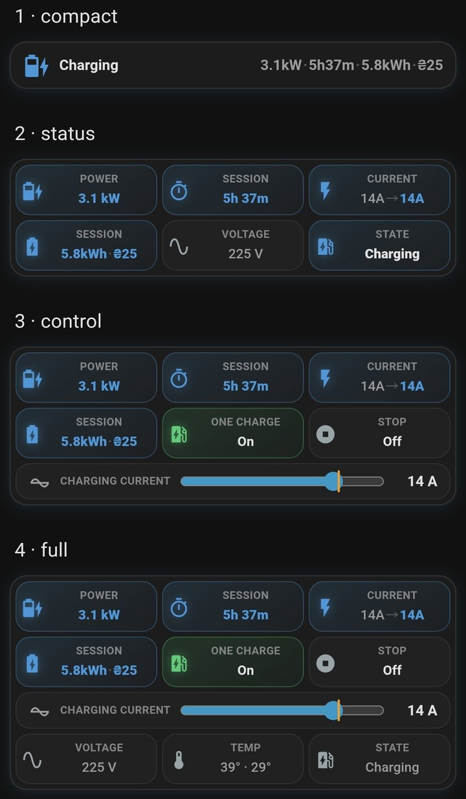

# Eveus EV Charger для Home Assistant

[English](README.md) | **🇺🇦 Українська**

[](https://github.com/hacs/default)


[](https://github.com/ABovsh/eveus/releases)

[](https://sonarcloud.io/summary/new_code?id=ABovsh_eveus)
[](https://sonarcloud.io/component_measures?id=ABovsh_eveus&metric=reliability_rating)
[](https://sonarcloud.io/component_measures?id=ABovsh_eveus&metric=security_rating)
[](https://sonarcloud.io/component_measures?id=ABovsh_eveus&metric=sqale_rating)
[](https://sonarcloud.io/component_measures?id=ABovsh_eveus&metric=coverage)

- Документація: <https://abovsh.github.io/eveus/uk/>
- Обговорення: [тема в Home Assistant Community](https://community.home-assistant.io/t/eveus-ev-charger-home-assistant-integration-local-only-hacs/1010628)
- Проблеми та пропозиції: [github.com/ABovsh/eveus/issues](https://github.com/ABovsh/eveus/issues)

<p align="center">
  
  
</p>

Інтеграція для зарядних станцій Eveus: керування заряджанням, перегляд показників станції, облік енергії та вартості, оцінка рівня заряду (SOC) батареї авто, розклади, сповіщення безпеки та сутності для автоматизацій. Інтеграція звертається до HTTP API станції напряму в локальній мережі, тому працює й без інтернету. Підтримувані показники та налаштування доступні як сутності Home Assistant.

**Швидкий перехід:** [Можливості](#-можливості) ·
[Встановлення](#встановлення) · [Налаштування](#налаштування) ·
[Сповіщення безпеки](#-сповіщення-безпеки) ·
[Картка Eveus](#картка-eveus) ·
[Ідентифікатори сутностей](#ідентифікатори-сутностей) ·
[Події та тригери пристрою](#події-та-тригери-пристрою) ·
[Готова панель](#готова-панель) ·
[Панель «Енергія»](#панель-енергія) ·
[Усунення несправностей](#усунення-несправностей)

## ✨ Можливості

### ⚡ Показники станції

Інтеграція показує дані, отримані від станції:

- **Напруга**, **Струм**, **Потужність** і **Встановлений струм**;
- **Струм фази 2**, **Струм фази 3**, **Напруга фази 2** і **Напруга фази 3** —
  для трифазного підключення;
- **Температура корпусу**, **Температура конектора**, **Заземлення** і
  **Напруга батарейки**.

### 💰 Енергія та вартість

Інтеграція показує енергію поточної сесії (**Енергія сесії**), загальне
споживання (**Загальна енергія**) і два лічильники A та B, які можна скидати
окремо. Для сесії й кожного лічильника є сенсор вартості.
Вартість рахує сама станція за власним лічильником, тому **Вартість сесії**
правильна й тоді, коли тариф змінюється посеред заряджання, — наприклад, із
нічного на денний о 07:00. Кожна тарифна ставка станції доступна окремим
сенсором.

### 🔋 Рівень заряду батареї авто

У **Розширеному** режимі доступні:

- **Рівень заряду** (%) і **Заряд батареї** (кВт·год) — оцінка заряду батареї
  під час заряджання;
- **Час до цільового заряду** і **Час завершення заряджання** — прогноз часу
  досягнення цільового рівня заряду;
- **Енергія до цільового заряду** і **Вартість до цільового заряду** — скільки
  енергії ще потрібно взяти з мережі з урахуванням втрат і скільки вона
  коштуватиме за поточним тарифом;
- **Початковий SOC**, **Цільовий SOC**, **Ємність батареї** і **Корекція SOC** —
  сутності `number`, які можна змінювати з будь-якої панелі чи автоматизації;
- за бажанням — сенсор заряду вашого авто: з нього **Початковий SOC**
  заповнюється автоматично, один раз за під'єднання.

Якщо вам потрібні лише керування й моніторинг заряджання, оберіть **Базовий**
режим. Режим можна змінити будь-коли через **Налаштувати**.

### 🛑 Ліміти заряджання

У Home Assistant можна задати ліміти заряджання й увімкнути потрібні:

- **Ліміт: Час**, **Ліміт: Енергія** і **Ліміт: Вартість** — зупинка за
  тривалістю сесії, переданими кВт·год або вартістю сесії;
- **Ліміт: SOC увімкнено** (Розширений режим) — інтеграція зупиняє заряджання, коли
  розрахований SOC досягає значення **Цільовий SOC**. Для цього Home Assistant
  має працювати й мати зв'язок зі станцією;
- **Розклад 1: ліміт струму** і **Розклад 1: ліміт енергії** (так само для
  другого розкладу) — окремі ліміти для кожного вікна заряджання;
- **Ліміт: вимкнути всі** — вимикає дію всіх лімітів одночасно, а їхні значення
  зберігаються.

### 🤖 Адаптивне заряджання та розклади

Адаптивний режим регулює заряджання залежно від умов живлення: коли напруга просідає,
станція зменшує струм заряджання. Інтеграція дає повне керування цією функцією:

- **Адаптивний режим** — вибір Off / Voltage / Auto / Power;
- **Адаптивне заряджання** — який адаптивний режим зараз активний;
- **Ліміт адаптивного струму** — обмеження струму, яке обрала станція;
- **Поріг зниження напруги** — напруга, за якої спрацьовує режим Voltage
  (210–220 В);
- два розклади з перемикачами, полями часу у форматі ГГ:ХХ і сенсорами-зведеннями.

Розклади зберігаються на самій станції, тому працюють і після перезапуску Home
Assistant.

### 🧩 Сутності для автоматизацій

Інтеграція одразу створює сутності, які найчастіше потрібні в автоматизаціях:

- бінарні сенсори **Автомобіль підключено** і **Сесія активна** — для тригерів
  і умов;
- **Час завершення заряджання** — сенсор із класом `timestamp`, тож працює з
  картками зворотного відліку та автоматизаціями за часом;
- **Вартість сесії**, керування розкладами та **Якість з'єднання** — без
  власних шаблонних сенсорів;
- **тригери пристрою**: заряджання почалося чи завершилося, сталася помилка, авто
  під'єднано чи від'єднано — обираються в редакторі автоматизацій без YAML;
- **події** (`eveus_charging_started`, `eveus_charging_finished`,
  `eveus_error`, `eveus_car_connected`, `eveus_car_disconnected`) — для
  автоматизацій, яким потрібні всі дані події; див.
  [Події та тригери пристрою](#події-та-тригери-пристрою).

### ☁️ Керування OCPP

Перемикач **Підключення до OCPP** підключає станцію до сервера OCPP, яким
користується мобільний застосунок **Grizzl-E Connect**. Бінарний сенсор
**З'єднання з OCPP** показує, чи станція зараз підключена до сервера.

Поки OCPP увімкнено, у **Виправленні проблем** є сповіщення: сервер OCPP або
мобільний застосунок можуть змінювати **Струм заряджання**, ліміти й розклади
замість Home Assistant. Там само описано, як вимкнути OCPP і повернути повне
локальне керування.

### 🌐 Українська та англійська мови

Інтеграція має український і англійський переклади. Home Assistant показує
назви сутностей і повідомлення мовою поточного користувача.

### 🛰️ Кілька станцій

Можна додати будь-яку кількість станцій Eveus. Для кожної Home Assistant створює
окремий пристрій і набір сутностей.

### 🩺 Опитування та відновлення зв'язку

- **Змінна частота опитування** — частіше під час заряджання, рідше під час
  простою, і кілька додаткових запитів поспіль, коли станція змінює стан сама:
  спрацював розклад, сесію запустили з інтерфейсу станції або через OCPP.
- **Вимкнена станція** — не заповнює журнал помилками, а після ввімкнення знову
  з'являється в Home Assistant протягом хвилини.
- **Підтвердження команд** — інтеграція перевіряє, чи прийняла станція команду,
  а зміни налаштувань звіряє з відповіддю станції. Помилки показує в Home Assistant.
- **Відновлення доступу** — після зміни пароля Home Assistant просить ввести
  нові облікові дані, а не показує станцію недоступною; пошкоджені налаштування
  підключення з'являються у **Виправленні проблем** і виправляються там само.
- **Діагностика** — завантажені діагностичні дані не містять облікових даних та
  ідентифікаційної інформації, тож їх можна додати до запиту на GitHub.

### 🛡️ Контроль безпеки

Станція має власні засоби захисту. Інтеграція показує їхні спрацювання в Home
Assistant, кожне окремим сповіщенням у **Виправленні проблем** (українською та
англійською):

- немає заземлення або вимкнено **Захист заземлення**;
- перегрів — попередження вже за **80 °C**, тобто до того, як станція вимкнеться
  сама за **85 °C**;
- струм витоку понад **30 мА**;
- несправності реле, керувального сигналу, діода, напруги, струму,
  самоперевірки захисту від витоку, внутрішнього зв'язку або програмного
  забезпечення;
- низька напруга внутрішньої батарейки CR2032.

Перемикач **Захист заземлення** визначає, чи вимикається станція, коли немає
заземлення.

Попередження за показниками температури, струму витоку та заземлення
потребують кількох послідовних підтверджень. Про відомі коди несправностей
станції інтеграція повідомляє одразу. Повний перелік — у розділі
[Сповіщення безпеки](#-сповіщення-безпеки).

## Вимоги

| Вимога | Деталі |
| --- | --- |
| Home Assistant | Версія 2025.1 або новіша |
| Зарядна станція | Eveus 16A, 32A, 40A або 48A, доступна з Home Assistant |
| Прошивка станції | Перевірено на R3.05.x. Старіша прошивка (R3.01.x, а також 1.x, де частина полів недоступна) підтримується, але оновити прошивку все одно варто — див. [Старіша прошивка станції](#старіша-прошивка-станції) |
| Мережа | Доступ Home Assistant до HTTP API станції в локальній мережі |
| Дані для підключення | IP-адреса, ім'я хоста або URL, ім'я користувача, пароль і модель |

## Встановлення

### Через HACS

Інтеграція є у **стандартному каталозі HACS** — додавати власний репозиторій не
потрібно.

[](https://my.home-assistant.io/redirect/hacs_repository/?owner=ABovsh&repository=eveus&category=integration)

Або вручну:

1. Відкрийте **HACS** і знайдіть **Eveus EV Charger**.
2. Встановіть інтеграцію.
3. Перезапустіть Home Assistant.

### Вручну

1. Скопіюйте каталог `custom_components/eveus` до каталогу
   `custom_components/` вашого Home Assistant.
2. Перезапустіть Home Assistant.

## Налаштування

[](https://my.home-assistant.io/redirect/config_flow_start/?domain=eveus)

1. Відкрийте **Налаштування → Пристрої та сервіси → Додати інтеграцію** і
   знайдіть **Eveus EV Charger**.
2. Введіть IP-адресу, ім'я хоста або повний URL станції. Можна вказати власний
   порт, `http://` або `https://`.
3. Введіть ім'я користувача та пароль. Це облікові дані вебінтерфейсу самої
   станції, а **не** логін від Home Assistant.
4. Оберіть модель: **16A**, **32A**, **40A** або **48A** — ту, що відповідає
   вашій станції. Якщо модель не збігається, станція не передає дані.
5. Оберіть режим інтеграції:
   - **Базовий (лише керування заряджанням)** — керування й моніторинг
     заряджання;
   - **Розширений (SOC + час до цільового рівня)** — додає параметри й сенсори
     рівня заряду.
6. **Лише в Розширеному режимі:** на наступному екрані вкажіть
   **Ємність батареї (кВт·год)** і **Втрати ефективності заряджання (%)**.
   Обидва значення потім можна змінити в самих сутностях.

Що можна змінити пізніше:

- **Налаштувати** — перемкнути Базовий або Розширений режим і обрати сенсор
  заряду авто (див. [Автозаповнення Початкового SOC з авто](#автозаповнення-початкового-soc-з-авто-необовязково)).
  Під час першого переходу на Розширений режим з'являється той самий екран
  ємності батареї, що й під час встановлення;
- **Переналаштувати** — адреса, облікові дані, модель і кількість фаз, без
  повторного встановлення інтеграції.

## 🛡️ Сповіщення безпеки

Небезпечні стани та проблеми налаштування з'являються в розділі **Налаштування →
Система → Виправлення проблем**, кожен із поясненням українською та англійською.
Сповіщення про стани, що минають самі, зникають автоматично після стабільного
відновлення. Сповіщення про серйозні події залишаються, доки ви не натиснете
**Ігнорувати**; після відновлення вони скидаються, щоб наступна подія знову
створила сповіщення.

### Небезпечні стани

| Сповіщення | Коли з'являється | Що робити |
| --- | --- | --- |
| Немає заземлення | Станція повідомляє про несправність заземлення або кілька разів поспіль — про його відсутність, незалежно від перемикача **Захист заземлення** | Припиніть заряджання й зверніться до кваліфікованого електрика; сповіщення зникає, коли заземлення стабільно відновиться |
| Захист заземлення вимкнено | Станція кілька разів поспіль повідомляє, що захист заземлення вимкнено, незалежно від того, чи є заземлення зараз | Увімкніть перемикач **Захист заземлення**: поки він вимкнений, станція може заряджати без підтвердженого заземлення |
| Перегрів корпусу або конектора | Станція повідомляє про перегрів, або температура тривалий час тримається на рівні **80 °C** чи вище — це попередження, станція вимикається сама за **85 °C** | Припиніть користуватися станцією, дайте їй охолонути; якщо це повторюється, зверніться до підтримки виробника |
| Струм витоку (GFCI) | Станція повідомляє про несправність або тривалий струм витоку понад **30 мА** | Припиніть користуватися станцією й зверніться до підтримки виробника |
| Несправність захисту станції | Станція повідомляє про несправність реле, керувального сигналу, діода, надмірний струм, занизьку чи зависоку напругу, невдалу самоперевірку GFCI, тайм-аут внутрішнього зв'язку або програмний збій | Припиніть або не починайте заряджання й зверніться до підтримки виробника |
| Помилка станції з невідомою причиною | Станція кілька опитувань поспіль перебуває в стані помилки, а код несправності відсутній або не розпізнаний | Перевірте несправність на дисплеї чи в застосунку станції, вимкніть і знову ввімкніть її живлення; якщо помилка повторюється, оновіть прошивку. Сповіщення зникає, коли несправність минула і ви натиснули **Ігнорувати** |
| Розряджається батарейка станції | Станція кілька разів поспіль повідомляє про низьку напругу внутрішньої батарейки CR2032 | Замініть її новою якісною батарейкою CR2032 |

### Проблеми налаштування

| Сповіщення | Коли з'являється | Що робити |
| --- | --- | --- |
| Налаштування зарядної станції Eveus потребує уваги | Збережені дані підключення неповні або недійсні | Відкрийте сповіщення й введіть дані станції ще раз |
| Увімкнено OCPP | OCPP увімкнено, тож сервер OCPP або мобільний застосунок може змінювати налаштування замість Home Assistant | Вимкніть перемикач **Підключення до OCPP**, щоб повернути повне локальне керування |
| Годинник станції відрізняється більш ніж на 10 хвилин | Кілька опитувань поспіль час станції відрізняється від часу Home Assistant більш ніж на 10 хвилин, тому розклади й тарифні вікна можуть спрацьовувати не вчасно | Перевірте **Часовий пояс**, потім натисніть **Синхронізувати час**; сповіщення зникає, щойно час збігається |
| Оновіть картки SOC та автоматизації | Досі існують старі помічники `input_number.ev_*` | Переведіть панелі й автоматизації на сутності `number.eveus_ev_charger_*` |

## Картка Eveus

Картка є частиною інтеграції, окремо встановлювати її не треба. Це **одна
картка** з параметром **layout** — вигляд. Додаючи картку на панель, ви обираєте
один вигляд, тобто рівень інформативності: від одного рядка до повного
керування заряджанням. Щоб мати на панелі і коротку, і повну картку, додайте
картку двічі й оберіть для кожної свій вигляд.

<p align="center">
  
  
</p>

*Обидва знімки показують ту саму картку чотири рази — з виглядом `compact`,
`status`, `control` і `full`, згори донизу. Ліворуч — Розширений режим, праворуч
— Базовий.*

### Вигляди

| Вигляд | Що показує | Чим можна керувати |
|---|---|---|
| `compact` | Один рядок: стан, смужка заряду, заряд · потужність · час до цілі | — |
| `status` | Заряд, час до цілі, струм, енергія й вартість сесії, потужність і напруга, стан | — (лише перегляд) |
| `control` | Заряд, час до цілі, струм, енергія й вартість сесії | **Одноразове заряджання**, **Зупинити заряджання**, повзунок **Струм заряджання** |
| `full` | Усе з `control`, а також енергія й вартість до цілі та час завершення | Усе з `control`, а також **Початковий SOC**, **Цільовий SOC**, **Ємність батареї**, **Корекція SOC** і перемикач **Ліміт: SOC увімкнено** |

- **Розширений і Базовий режим.** Картка працює в тому режимі, який обрано для
  інтеграції (**Налаштувати**). У Базовому режимі замість заряду й часу до цілі
  картка показує потужність і час сесії, а `full` замість параметрів SOC
  показує напругу, температури й стан. Параметр `mode: basic` вмикає Базовий
  вигляд картки незалежно від режиму інтеграції.
- **Натискання.** Натискання на плитку відкриває вікно сутності. **Одноразове
  заряджання**, **Зупинити заряджання** і **Ліміт: SOC увімкнено** перемикаються
  одним натисканням; перед зупинкою активного заряджання картка просить
  підтвердження. Повзунок надсилає значення, коли ви його відпускаєте. Кнопки
  − / + надсилають значення після короткої паузи, тож кілька натискань поспіль
  дають одну команду.
- **Несправності.** Якщо станція в стані `Error` або немає заземлення, у
  виглядах `status`, `control` і `full` з'являється червоний рядок.

### Як додати картку

1. Встановіть або оновіть інтеграцію й перезапустіть Home Assistant. Картка
   реєструється автоматично.
2. Оновіть сторінку в браузері. У мобільному застосунку Home Assistant:
   **Settings → Companion app → Troubleshooting → Reset frontend cache**, потім
   перезапустіть застосунок.
3. Відкрийте панель і натисніть олівець (**Редагувати панель**).
4. Натисніть **Додати картку**, введіть у пошуку **Eveus EV Charger** і оберіть
   картку.
5. У полі **layout** оберіть вигляд. Попередній перегляд одразу показує
   результат; нова картка має вигляд `control`.
6. Інші поля заповнюйте лише за потреби: **device_id** — станція, якщо їх
   кілька; **mode** — Базовий вигляд картки; **language** — мова картки. Для
   однієї станції підходять типові значення.
7. Натисніть **Зберегти**.

### Картка в YAML

```yaml
type: custom:eveus-card
layout: control      # compact | status | control | full
# device_id: ...     # лише якщо станцій кілька
# mode: auto         # auto (типово, за режимом інтеграції) | basic
# language: uk       # auto (типово, мова Home Assistant) | uk | en
```

Якщо одразу після оновлення замість картки видно **Custom element doesn't
exist**, повторіть крок 2.

## Ідентифікатори сутностей

Нижче наведено типові ідентифікатори сутностей першої станції з назвою
**Eveus EV Charger**. Якщо ви перейменували сутності або додали кілька станцій,
Home Assistant може додати до ідентифікаторів суфікс. Унікальні ідентифікатори
не змінюються, тому історія та картки на панелях зберігаються після оновлень.

### Стан заряджання та керування

<details>
<summary>Показати сутності</summary>

| Ідентифікатор | Тип | Назва в інтерфейсі та призначення |
| --- | --- | --- |
| `sensor.eveus_ev_charger_state` | Сенсор | **Стан** — основний стан станції: очікування, заряджання, завершено, помилка. Клас `enum`, тому тригер за станом пропонує список усіх можливих значень |
| `sensor.eveus_ev_charger_substate` | Сенсор | **Детальний стан** — уточнення стану або назва помилки. Клас `enum`, так само зі списком значень |
| `sensor.eveus_ev_charger_not_charging_reason` | Сенсор | **Причина зупинки заряджання** — чому заряджання зараз не відбувається: кабель не під'єднано, станція чекає на авто, досягнуто ліміту, станція чекає на розклад тощо. Поки увімкнено перемикач **Підключення до OCPP**, показує **Controlled by OCPP**, бо момент початку сесії визначає сервер або мобільний застосунок. Клас `enum`; у стані помилки назва несправності — в атрибуті `error` (на сучасних прошивках) |
| `binary_sensor.eveus_ev_charger_car_connected` | Бінарний сенсор | **Автомобіль підключено** — авто під'єднане до станції |
| `binary_sensor.eveus_ev_charger_session_active` | Бінарний сенсор | **Сесія активна** — сесія заряджання триває або на паузі |
| `binary_sensor.eveus_ev_charger_ocpp_connected` | Бінарний сенсор | **З'єднання з OCPP** — чи підключена станція до сервера OCPP, за її власними даними (діагностична сутність) |
| `number.eveus_ev_charger_charging_current` | Число, А | **Струм заряджання** — повзунок струму; межі залежать від моделі станції |
| `number.eveus_ev_charger_limit_time` | Число, хв | **Ліміт: Час** — ліміт тривалості сесії |
| `number.eveus_ev_charger_limit_energy` | Число, кВт·год | **Ліміт: Енергія** — ліміт енергії за сесію |
| `number.eveus_ev_charger_limit_cost` | Число, грн | **Ліміт: Вартість** — ліміт вартості сесії |
| `select.eveus_ev_charger_minimum_voltage` | Вибір, В | **Мінімальна напруга** — найнижча напруга живлення, за якої станція ще заряджає: 150–200 В. Це окреме налаштування, не **Поріг зниження напруги** адаптивного режиму |
| `switch.eveus_ev_charger_stop_charging` | Перемикач | **Зупинити заряджання** — зупиняє або дозволяє заряджання на станції |
| `switch.eveus_ev_charger_one_charge` | Перемикач | **Одноразове заряджання** — вмикає режим одноразового заряджання |
| `switch.eveus_ev_charger_ground_protection` | Перемикач | **Захист заземлення** — чи вимикається станція, коли немає заземлення. Поки перемикач вимкнений, станція заряджає без підтвердженого заземлення |
| `switch.eveus_ev_charger_connect_to_ocpp` | Перемикач | **Підключення до OCPP** — підключає станцію до сервера OCPP (ним користується застосунок Grizzl-E Connect). Поки перемикач увімкнений, у **Виправленні проблем** є сповіщення, що сервер може змінювати **Струм заряджання**, ліміти й розклади, і як вимкнути OCPP |
| `switch.eveus_ev_charger_limit_time_enabled` | Перемикач | **Ліміт: Час увімкнено** — вмикає ліміт часу |
| `switch.eveus_ev_charger_limit_energy_enabled` | Перемикач | **Ліміт: Енергія увімкнено** — вмикає ліміт енергії |
| `switch.eveus_ev_charger_limit_cost_enabled` | Перемикач | **Ліміт: Вартість увімкнено** — вмикає ліміт вартості |
| `switch.eveus_ev_charger_limit_disable_all` | Перемикач | **Ліміт: вимкнути всі** — вимикає дію всіх лімітів одночасно |
| `switch.eveus_ev_charger_limit_soc_enabled` | Перемикач | **Ліміт: SOC увімкнено** — зупинка після досягнення значення **Цільовий SOC** (лише Розширений режим) |
| `button.eveus_ev_charger_force_refresh` | Кнопка | **Примусове оновлення** — негайно опитати станцію |

Ліміти часу, енергії та вартості виконує сама станція: задайте значення й
увімкніть відповідний перемикач. **Ліміт: вимкнути всі** вимикає дію всіх цих
лімітів. **Ліміт: SOC увімкнено** виконує інтеграція в Розширеному режимі: коли
заряд авто досягає значення **Цільовий SOC**, інтеграція надсилає звичайну команду
**Зупинити заряджання** і створює подію `eveus_soc_limit_reached` з полями
`device_number`, `soc` і `target_soc`.

Цю подію можна використати у власній автоматизації сповіщень:

```yaml
automation:
  - alias: Досягнуто ліміт SOC Eveus
    triggers:
      - trigger: event
        event_type: eveus_soc_limit_reached
    actions:
      - action: notify.notify
        data:
          message: "Eveus досяг цільового SOC: {{ trigger.event.data.soc }}%"
```

</details>

### Показники станції

<details>
<summary>Показати сутності</summary>

| Ідентифікатор | Одиниця | Назва в інтерфейсі та призначення |
| --- | --- | --- |
| `sensor.eveus_ev_charger_voltage` | В | **Напруга** — напруга живлення |
| `sensor.eveus_ev_charger_current` | А | **Струм** — струм заряджання |
| `sensor.eveus_ev_charger_power` | Вт | **Потужність** — потужність заряджання |
| `sensor.eveus_ev_charger_current_set` | А | **Встановлений струм** — обмеження струму, задане на станції |
| `sensor.eveus_ev_charger_current_phase_2` | А | **Струм фази 2** — лише коли **Фази = 3** |
| `sensor.eveus_ev_charger_current_phase_3` | А | **Струм фази 3** — лише коли **Фази = 3** |
| `sensor.eveus_ev_charger_voltage_phase_2` | В | **Напруга фази 2** — лише коли **Фази = 3** |
| `sensor.eveus_ev_charger_voltage_phase_3` | В | **Напруга фази 3** — лише коли **Фази = 3** |

</details>

### Енергія, вартість і тарифи

<details>
<summary>Показати сутності</summary>

| Ідентифікатор | Одиниця | Назва в інтерфейсі та призначення |
| --- | --- | --- |
| `sensor.eveus_ev_charger_session_time` | — | **Час сесії** — тривалість поточної сесії заряджання |
| `sensor.eveus_ev_charger_session_energy` | кВт·год | **Енергія сесії** — енергія, передана в поточній сесії |
| `sensor.eveus_ev_charger_total_energy` | кВт·год | **Загальна енергія** — лічильник за весь час роботи станції |
| `sensor.eveus_ev_charger_counter_a_energy` | кВт·год | **Енергія лічильника A** — лічильник, який можна скинути |
| `sensor.eveus_ev_charger_counter_b_energy` | кВт·год | **Енергія лічильника B** — лічильник, який можна скинути |
| `sensor.eveus_ev_charger_session_cost` | грн | **Вартість сесії** — вартість поточної сесії за даними станції |
| `sensor.eveus_ev_charger_counter_a_cost` | грн | **Вартість лічильника A** — вартість енергії лічильника A |
| `sensor.eveus_ev_charger_counter_b_cost` | грн | **Вартість лічильника B** — вартість енергії лічильника B |
| `sensor.eveus_ev_charger_primary_rate_cost` | грн/кВт·год | **Вартість основного тарифу** — ставка основного тарифу |
| `sensor.eveus_ev_charger_active_rate_cost` | грн/кВт·год | **Вартість активного тарифу** — ставка, що діє зараз |
| `sensor.eveus_ev_charger_rate_2_cost` | грн/кВт·год | **Вартість тарифу 2** — ставка другого тарифу |
| `sensor.eveus_ev_charger_rate_3_cost` | грн/кВт·год | **Вартість тарифу 3** — ставка третього тарифу |
| `sensor.eveus_ev_charger_rate_2_status` | — | **Статус тарифу 2** — чи увімкнений розклад другого тарифу |
| `sensor.eveus_ev_charger_rate_3_status` | — | **Статус тарифу 3** — чи увімкнений розклад третього тарифу |
| `sensor.eveus_ev_charger_last_session_energy` | кВт·год | **Енергія останньої сесії** — енергія останньої завершеної сесії; значення зберігається після перезапуску та поки станція недоступна |
| `sensor.eveus_ev_charger_last_session_cost` | грн | **Вартість останньої сесії** — вартість останньої завершеної сесії |
| `sensor.eveus_ev_charger_last_session_duration` | с | **Тривалість останньої сесії** — тривалість останньої завершеної сесії |

Сенсори останньої сесії заповнюються, коли сесія завершується, і мають атрибути
`reason` і `finished_at`.

</details>

### SOC і час до цільового заряду

У Розширеному режимі є чотири сутності `number` для параметрів SOC.

<details>
<summary>Показати сутності</summary>

| Ідентифікатор | Одиниця | Діапазон | Типове | Назва в інтерфейсі та призначення |
| --- | --- | --- | --- | --- |
| `number.eveus_ev_charger_initial_soc` | % | 0–100, крок 1 | 20 | **Початковий SOC** — заряд батареї на початку поточної сесії |
| `number.eveus_ev_charger_target_soc` | % | 0–100, крок 5 | 80 | **Цільовий SOC** — цільовий заряд для прогнозів і ліміту SOC |
| `number.eveus_ev_charger_battery_capacity` | кВт·год | 10–160, крок 1 | 50 | **Ємність батареї** — повна ємність батареї вашого авто |
| `number.eveus_ev_charger_soc_correction` | % | 0–20, крок 0,5 | 7,5 | **Корекція SOC** — поправка на втрати під час заряджання |
| `sensor.eveus_ev_charger_soc_energy` | кВт·год | — | — | **Заряд батареї** — оцінка енергії, що зараз є в батареї |
| `sensor.eveus_ev_charger_soc_percent` | % | — | — | **Рівень заряду** — оцінка заряду у відсотках |
| `sensor.eveus_ev_charger_time_to_target_soc` | — | — | — | **Час до цільового заряду** — прогноз часу до досягнення значення **Цільовий SOC** |
| `sensor.eveus_ev_charger_charging_finish_time` | Часова мітка | — | — | **Час завершення заряджання** — час завершення для автоматизацій і карток із часовою міткою |
| `sensor.eveus_ev_charger_energy_to_target_soc` | кВт·год | — | — | **Енергія до цільового заряду** — скільки енергії ще треба взяти з мережі, з урахуванням втрат |
| `sensor.eveus_ev_charger_cost_to_target_soc` | грн | — | — | **Вартість до цільового заряду** — прогноз вартості за активним тарифом |

Щоб перевести картки й автоматизації зі старих помічників, замініть префікс
`input_number.ev_` на `number.eveus_ev_charger_`. Наприклад,
`input_number.ev_initial_soc` стає `number.eveus_ev_charger_initial_soc`.

SOC розраховується з власного значення `sessionEnergy` станції. Станція скидає
його під час кожного нового під'єднання, тому після перезапуску Home Assistant
розрахунок для поточної сесії продовжується.
Якщо ви від'єднали авто й пізніше заряджаєте його знову, перед новою сесією
вкажіть актуальний **Початковий SOC**.

</details>

#### Автозаповнення Початкового SOC з авто (необов'язково)

Якщо інша інтеграція показує рівень заряду вашого авто, Eveus може брати
значення звідти, і вам не треба щоразу пересувати повзунок **Початковий SOC**
перед заряджанням. Інтеграція розраховує SOC і прогнози з початкового заряду, ємності батареї,
корекції втрат і лічильника енергії станції.

**Як налаштувати**

Оберіть сенсор у полі **Датчик заряду авто** — під час встановлення на екрані
**Налаштування моніторингу рівня заряду (SOC)** або пізніше в **Налаштування →
Пристрої та сервіси → Eveus EV Charger → Налаштувати**. Підходить лише сутність
`sensor` із класом пристрою `battery`, яка показує заряд у відсотках.
Список відфільтровано за цим класом пристрою. Якщо потрібного сенсора немає, перевірте його
домен і клас пристрою; значення має бути відсотком заряду від 0 до 100. Поле є
лише в Розширеному режимі. Якщо сенсор не обрано, задавайте **Початковий SOC** вручну.

**Коли зчитується заряд авто**

Один раз за під'єднання, на початку заряджання. Якщо авто в цей момент у режимі
сну — це звично з таймером відправлення чи вікном дешевого тарифу, — інтеграція
повторює спробу під час кожного опитування, доки не отримає значення. Енергію,
яку станція вже передала в авто, інтеграція при цьому віднімає, тож пізніше
зчитування дає той самий результат, що й негайне. Після успішного зчитування
сенсор до від'єднання авто більше не опитується.

**SOC під час паузи та відновлення.** Пауза й відновлення, зупинка й повторний
запуск, завершення й дозаряджання, помилка, після якої станція відновилася сама,
— для станції це одна сесія, і її лічильник енергії працює безперервно.
**Початковий SOC** зберігається, а розрахунок враховує накопичену енергію.
Після від'єднання й нового під'єднання потрібне нове початкове значення.

**Значення, введене вручну, має пріоритет.** Якщо ви пересунули повзунок самі,
це значення зберігається до наступного під'єднання — зокрема після перезапуску
Home Assistant чи збереження налаштувань інтеграції під час заряджання.

**Як побачити, звідки взято значення.** Сенсор **Рівень заряду** має атрибут
`soc_anchor`: він показує, як востаннє було задано **Початковий SOC** — яке
значення й з якого сенсора взято, чому зчитати не вдалося, або `set manually`.
Застаріле значення **Початковий SOC** спотворює всі показники SOC без жодної
помилки, тому атрибут показує, звідки воно взялося.

**Якщо нічого не заповнюється**

Перегляньте журнал. Для кожного під'єднання там є один рядок із назвою сенсора
і причиною (`the sensor reads 'unavailable'`, `the charger did not report
session energy`, …). **Завантажити діагностику** показує те саме в розділі
`soc`, а також поточне значення сенсора авто. Якщо сенсор не обрано, ця функція
не працює і нічого не пише в журнал.

### Адаптивне заряджання та розклади

<details>
<summary>Показати сутності</summary>

| Ідентифікатор | Тип | Назва в інтерфейсі та призначення |
| --- | --- | --- |
| `select.eveus_ev_charger_adaptive_mode` | Вибір | **Адаптивний режим** — Off / Voltage / Auto / Power |
| `sensor.eveus_ev_charger_adaptive_charging` | Сенсор | **Адаптивне заряджання** — який адаптивний режим зараз активний |
| `sensor.eveus_ev_charger_adaptive_current_limit` | А | **Ліміт адаптивного струму** — обмеження струму, яке обрав адаптивний режим |
| `number.eveus_ev_charger_undervoltage_threshold` | В | **Поріг зниження напруги** — напруга, за якої спрацьовує режим Voltage: 210–220 В |
| `switch.eveus_ev_charger_schedule_1_enabled` | Перемикач | **Розклад 1 увімкнено** — вмикає або вимикає перший розклад |
| `time.eveus_ev_charger_schedule_1_start` | Час | **Початок розкладу 1** — час початку вікна заряджання |
| `time.eveus_ev_charger_schedule_1_stop` | Час | **Завершення розкладу 1** — час завершення вікна |
| `number.eveus_ev_charger_schedule_1_current_limit` | А | **Розклад 1: ліміт струму** — ліміт струму для цього вікна |
| `switch.eveus_ev_charger_schedule_1_current_limit_enabled` | Перемикач | **Розклад 1: ліміт струму увімкнено** — вмикає цей ліміт |
| `number.eveus_ev_charger_schedule_1_energy_limit` | кВт·год | **Розклад 1: ліміт енергії** — ліміт енергії для цього вікна |
| `switch.eveus_ev_charger_schedule_1_energy_limit_enabled` | Перемикач | **Розклад 1: ліміт енергії увімкнено** — вмикає цей ліміт |
| `sensor.eveus_ev_charger_schedule_1` | Сенсор | **Розклад 1** — зведення першого розкладу в атрибутах |
| `switch.eveus_ev_charger_schedule_2_enabled` | Перемикач | **Розклад 2 увімкнено** — вмикає або вимикає другий розклад |
| `time.eveus_ev_charger_schedule_2_start` | Час | **Початок розкладу 2** — час початку вікна заряджання |
| `time.eveus_ev_charger_schedule_2_stop` | Час | **Завершення розкладу 2** — час завершення вікна |
| `number.eveus_ev_charger_schedule_2_current_limit` | А | **Розклад 2: ліміт струму** — ліміт струму для цього вікна |
| `switch.eveus_ev_charger_schedule_2_current_limit_enabled` | Перемикач | **Розклад 2: ліміт струму увімкнено** — вмикає цей ліміт |
| `number.eveus_ev_charger_schedule_2_energy_limit` | кВт·год | **Розклад 2: ліміт енергії** — ліміт енергії для цього вікна |
| `switch.eveus_ev_charger_schedule_2_energy_limit_enabled` | Перемикач | **Розклад 2: ліміт енергії увімкнено** — вмикає цей ліміт |
| `sensor.eveus_ev_charger_schedule_2` | Сенсор | **Розклад 2** — зведення другого розкладу в атрибутах |

Кожен розклад має власні ліміти струму й енергії з окремими перемикачами.

</details>

### Діагностика та обслуговування

<details>
<summary>Показати сутності</summary>

| Ідентифікатор | Одиниця або тип | Назва в інтерфейсі та призначення |
| --- | --- | --- |
| `sensor.eveus_ev_charger_connection_quality` | % | **Якість з'єднання** — частка вдалих опитувань; затримка та інші показники зв'язку в атрибутах |
| `sensor.eveus_ev_charger_ground` | — | **Заземлення** — стан заземлення |
| `sensor.eveus_ev_charger_time_drift` | с | **Зміщення часу** — різниця між годинником станції та часом Home Assistant: 0 — годинники збігаються, стале ±3600 — неправильний часовий пояс або перехід на літній час |
| `sensor.eveus_ev_charger_box_temperature` | °C | **Температура корпусу** — температура корпусу станції |
| `sensor.eveus_ev_charger_plug_temperature` | °C | **Температура конектора** — температура конектора |
| `sensor.eveus_ev_charger_battery_voltage` | В | **Напруга батарейки** — напруга внутрішньої батарейки станції |
| `sensor.eveus_ev_charger_leakage_current` | мА | **Струм витоку** — поточне значення струму витоку |
| `sensor.eveus_ev_charger_leakage_current_peak` | мА | **Піковий струм витоку** — найбільше зафіксоване значення |
| `sensor.eveus_ev_charger_wifi_signal` | дБм | **Сигнал WiFi** — рівень сигналу Wi-Fi станції |
| `select.eveus_ev_charger_time_zone` | Вибір | **Часовий пояс** — часовий пояс станції, від `-12` до `+14` |
| `button.eveus_ev_charger_sync_time` | Кнопка | **Синхронізувати час** — записує час Home Assistant у станцію |
| `button.eveus_ev_charger_reset_counter_a` | Кнопка | **Скинути лічильник A** — обнуляє лічильник A |
| `button.eveus_ev_charger_reset_counter_b` | Кнопка | **Скинути лічильник B** — обнуляє лічильник B |

</details>

### Події та тригери пристрою

Коли станція змінює стан, інтеграція створює подію в Home Assistant. Кожна подія
містить поле `device_number`:

| Подія | Коли створюється | Додаткові поля |
| --- | --- | --- |
| `eveus_charging_started` | Почалася сесія заряджання | — |
| `eveus_charging_finished` | Сесія заряджання завершилася | `reason` (`complete`, `unplugged`, `stopped` або `paused`), `session_energy_kwh`, `session_cost`, `session_duration_s` |
| `eveus_error` | Станція перейшла в стан помилки | `error_code`, `error_text` |
| `eveus_car_connected` | Авто під'єднано | — |
| `eveus_car_disconnected` | Авто від'єднано | — |

Енергія, вартість і тривалість у `eveus_charging_finished` беруться з
останнього опитування, коли сесія ще тривала. Тому ці значення не зникають,
навіть якщо станція обнуляє власні лічильники наприкінці сесії, але можуть
відставати від остаточних на один інтервал опитування. Зміни стану, які
сталися, поки станція була недоступна або Home Assistant був вимкнений, подій
не створюють — тож після відновлення зв'язку чи перезапуску хибних подій не
буде.

Кожна подія має відповідний **тригер пристрою**: у редакторі автоматизацій,
обравши пристрій Eveus, ви побачите тригери «Заряджання почалося», «Заряджання
завершилося», «Сталася помилка», «Автомобіль підключено» і «Автомобіль
відключено» — без YAML.

Для автоматизацій, яким потрібні дані події, використовуйте тригер за подією:

```yaml
automation:
  - alias: Підсумок сесії Eveus
    triggers:
      - trigger: event
        event_type: eveus_charging_finished
    actions:
      - action: notify.notify
        data:
          message: >-
            Сесія завершена ({{ trigger.event.data.reason }}):
            {{ trigger.event.data.session_energy_kwh }} кВт·год,
            {{ trigger.event.data.session_cost }} грн
```

## Готова панель

Готова вкладка панелі типу **Sections** з основними показниками й елементами
керування Eveus доступна у
файлі [`docs/dashboard-uk.yaml`](docs/dashboard-uk.yaml) (**v1.2**). Англійська
версія з таким самим компонуванням — у файлі
[`docs/dashboard.yaml`](docs/dashboard.yaml). Home Assistant не перекладає
підписи на панелях, тому кожен файл має власні підписи; ідентифікатори сутностей
в обох файлах однакові, тож файл можна замінити будь-коли, не втративши історію
та автоматизації.

Для двох графіків потрібна картка
[`mini-graph-card`](https://github.com/kalkih/mini-graph-card) з HACS. Решта
карток — стандартні картки Home Assistant.


> [!IMPORTANT]
> `docs/dashboard-uk.yaml` — це ціла вкладка панелі, а не окрема картка. Не
> вставляйте його через **Додати картку → Вручну**: там очікується одна картка,
> і редактор покаже помилку. Його потрібно додати в текстовий редактор панелі, до
> списку `views:`, як описано нижче.

### Як додати готову панель

1. Відкрийте **Налаштування → Інформаційні панелі**. Відкрийте наявну панель або
   створіть окрему: **Додати інформаційну панель → Нова інформаційна панель з
   нуля**.
2. Відкрийте панель і натисніть олівець (**Редагувати панель**).
3. Натисніть **⋮ → Текстовий редактор**.
4. У редакторі є YAML, що починається з `views:`. Скопіюйте **весь вміст**
   [`docs/dashboard-uk.yaml`](docs/dashboard-uk.yaml) і вставте його як новий
   елемент списку `views:`:

   ```yaml
   views:
     - title: Eveus       # ← сюди весь вміст docs/dashboard-uk.yaml, з відступом під views:
       path: eveus
       type: sections
       sections:
         - ...
   ```

   Якщо панель нова й порожня, можна замінити весь текст у редакторі на:

   ```yaml
   views:
     - <вміст docs/dashboard-uk.yaml з відступом у два пробіли після "- ">
   ```

5. Натисніть **Зберегти** й закрийте редактор. На панелі з'явиться вкладка
   **Eveus**.

Якщо ідентифікатори ваших сутностей не містять `eveus_ev_charger` (ви
перейменували станцію або маєте кілька станцій), замініть у файлі
`eveus_ev_charger` на свій фрагмент ідентифікатора — або після вставлення
виправте кожну сутність через вибір сутності в Home Assistant.

Для трифазної станції додайте до секції **Стан** сенсори
`sensor.eveus_ev_charger_current_phase_2`/`_3` і `…_voltage_phase_2`/`_3` — вони
існують лише коли **Фази = 3**.

## Панель «Енергія»

Щоб додати заряджання авто на панель «Енергія» Home Assistant:

1. Відкрийте **Налаштування → Енергія** (до Home Assistant 2026 — **Налаштування →
   Інформаційні панелі → Енергія**).
2. У блоці **Окремі пристрої** натисніть **Додати пристрій**.
3. Оберіть `sensor.eveus_ev_charger_total_energy` і збережіть.

Заряджання з'явиться окремим стовпчиком на графіках енергії, з історією за дні й
місяці. Вартість обчислює станція, а інтеграція показує її в сутностях — див.
`sensor.eveus_ev_charger_session_cost` і сенсори вартості лічильників A та B.
Вони використовують тарифи, налаштовані на станції, зокрема нічний.

## Проекти автоматизацій

Разом з інтеграцією постачаються два готові проекти (blueprints). Імпортуйте
потрібний через **Налаштування → Автоматизації та сцени → Проекти →
Імпортувати проект**, вставте посилання й заповніть два-три поля — без YAML.

| Проект | Що робить | Посилання |
| --- | --- | --- |
| Сповіщення про сесію заряджання | Надсилає сповіщення про початок і завершення сесії з енергією, вартістю та тривалістю після завершення — через обрану вами дію | [`notify_session.yaml`](https://github.com/ABovsh/eveus/blob/main/blueprints/automation/eveus/notify_session.yaml) |
| Зупинка заряджання при низькому заряді домашньої батареї | Коли заряд батареї інвертора залишається нижче порогу протягом двох хвилин, зупиняє заряджання командою самої станції **Зупинити заряджання**, а не вимкненням живлення. Після відновлення заряду автоматично не запускає заряджання | [`stop_on_low_house_battery.yaml`](https://github.com/ABovsh/eveus/blob/main/blueprints/automation/eveus/stop_on_low_house_battery.yaml) |

## Усунення несправностей

| Проблема | Що перевірити |
| --- | --- |
| Не вдається підключитися під час налаштування | Вікно налаштування показує причину в дужках — наприклад, `Не вдалося підключитися до зарядної станції (HTTP 404), перевірте IP-адресу` або `(Connection error: TimeoutError)`. Перевірте, що станція ввімкнена, Home Assistant може з'єднатися з її IP-адресою чи ім'ям хоста, облікові дані правильні, а обрана модель відповідає станції |
| Керування не спрацьовує | Перевірте **Якість з'єднання**, чи доступна станція, і облікові дані через **Переналаштувати**; потім дочекайтеся наступного опитування |
| Немає сутностей SOC | Через **Налаштувати** оберіть **Розширений (SOC + час до цільового рівня)**; після збереження інтеграція перезавантажується автоматично |
| Неправильний SOC після від'єднання й повторного під'єднання | Перед новою сесією вкажіть фактичний **Початковий SOC** |
| Станцію вимкнено | Це нормально: інтеграція опитує станцію рідше й не заповнює журнал помилками |
| З'явилося сповіщення у Виправленні проблем | Що означає кожне сповіщення і що робити — у розділі [Сповіщення безпеки](#-сповіщення-безпеки) |
| Станції немає серед пристроїв | Див. [Станція не з'являється після встановлення](#станція-не-зявляється-після-встановлення) |

### Станція не з'являється після встановлення

Перевірте по черзі:

1. **Встановлення через HACS не додає інтеграцію.** HACS лише завантажує файли й
   створює власний запис *Eveus EV Charger* з однією сутністю оновлення — цей
   запис належить HACS, а не вашій станції. Після встановлення перезапустіть
   Home Assistant, потім відкрийте **Налаштування → Пристрої та сервіси →
   Додати інтеграцію** і додайте **Eveus EV Charger**.
2. **Перевірте вимкнені інтеграції.** Вимкнений запис повністю зникає зі списку
   пристроїв. У розділі **Налаштування → Пристрої та сервіси** прогорніть
   вкладку **Інтеграції** донизу й натисніть **Показати вимкнені інтеграції** —
   там запис можна знову ввімкнути.
3. **Дивіться вкладку Інтеграції, а не Пристрої.** Якщо налаштування не
   вдалося, запис існує, але пристрою й сутностей ще немає — тож серед пристроїв
   його не видно, а картка *Eveus* на вкладці **Інтеграції** показує **Повторна
   спроба налаштування**. Відкрийте цю картку, щоб побачити причину; вона також
   один раз записується в **Налаштування → Система → Журнал сервера**.

Кількість сутностей залежить від режиму інтеграції та кількості фаз.
Якщо ви бачите лише одну сутність оновлення, це запис HACS, а не інтеграція.

### Старіша прошивка станції

Старіша прошивка (повідомляли про R3.01.x) налаштовується й працює: налаштування
приймає будь-яку станцію, що відповідає, зокрема станції без заданого
серійного номера, які замість нього повертають довільні байти. Оновити прошивку
все одно варто: напишіть **@energy_star** у Telegram, щоб отримати файли
прошивки, і оновіть її через вебінтерфейс станції.

Прошивка 1.x (серія EnergyStar V) теж налаштовується й працює, але частина
даних обмежена. Версію прошивки інтеграція бере з даних завантаження станції
замість звичайного поля, а власні коди станів цієї прошивки перекладає у
стандартні назви: простій показується як Standby, а Charging — поки станція
справді віддає потужність. Нерозпізнаний код показується як `Unknown`, а його
числове значення — в атрибуті `raw_state` сенсора **Стан**. Поля, яких ця
прошивка не передає (наприклад, серійний номер, **Детальний стан** чи стан
OCPP), залишаються недоступними, а не показують застарілі чи хибні дані.

Якщо станцію все одно не вдається налаштувати, запишіть помилку з вікна
налаштування, знайдіть попередження інтеграції в **Налаштування → Система →
Журнал сервера** (там є HTTP-статус, тип вмісту й перші байти відповіді станції;
вмикати налагоджувальний журнал не потрібно) і створіть
[запит на GitHub](https://github.com/ABovsh/eveus/issues) з версією прошивки,
текстом помилки та цим рядком журналу. Перед цим приховайте чутливі дані
(IP-адреси, серійні номери).

## Конфіденційність і діагностика

Home Assistant зберігає дані підключення, параметри SOC і підсумок останньої
сесії. Історія сутностей зберігається відповідно до ваших налаштувань Recorder.
Перед експортом діагностики інтеграція видаляє з неї облікові дані та
ідентифікаційну інформацію. Обмін даними зі станцією відбувається лише в
локальній мережі.

---

Якщо інтеграція вам корисна, поставте репозиторію ⭐ — так іншим легше її знайти.

## Ліцензія

MIT.
